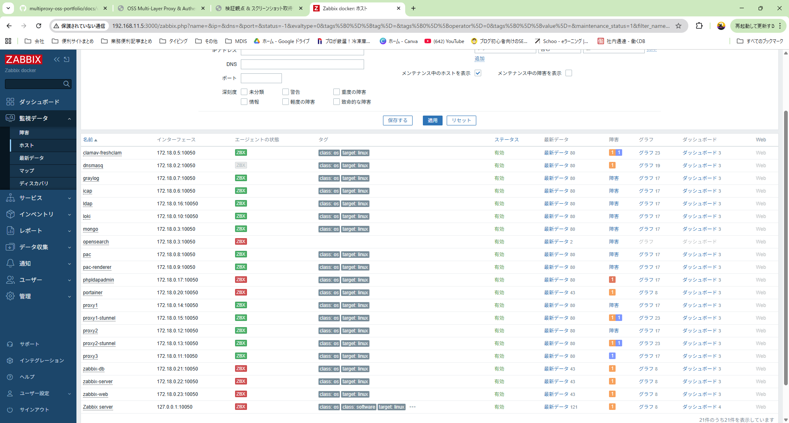
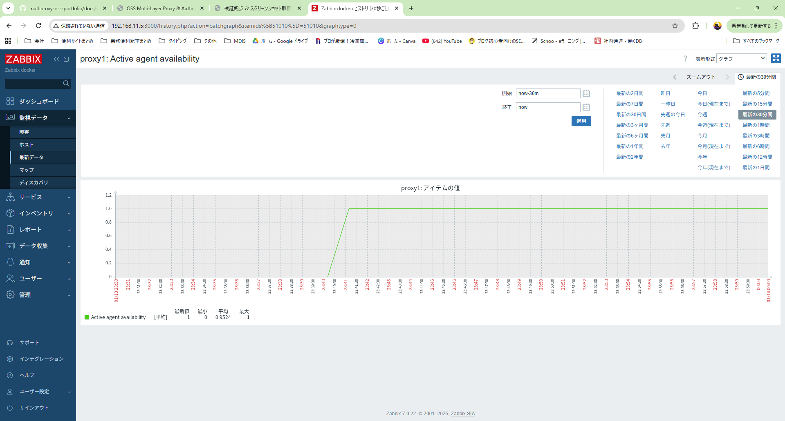
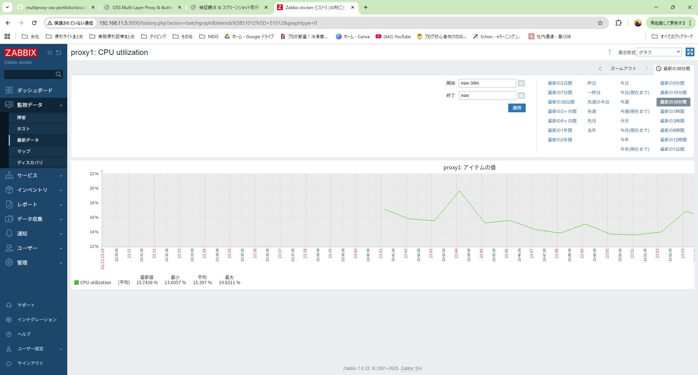

# Automation（構築・検証・可視化の自動化）

本ドキュメントでは、本プロジェクトにおける  
**構築・起動・検証・復旧・監視可視化までを一貫して担う自動化**について整理します。

本プロジェクトで重視したのは、  
**「一度動いた環境」ではなく「何度でも同じ状態まで再現でき、かつ“動いていることを証明できる”環境」**です。

---

## 0. この Automation で何を証明しているか（結論）

この Automation によって、以下を証明しています。

- 環境を破棄しても、同一構成を何度でも再構築できる
- 途中失敗時に「どの STEP で止まり、次に何を見るべきか」が分かる
- 再構築後に、通信・認証・ログ・監視が可視化された状態まで自動で到達できる

つまり、

「構築できる」ではなく  
**「運用・検証できる状態まで再現できる」**

ことを目的とした Automation です。

---

## 1. 自動化の設計思想

自動化にあたり、以下を方針としました。

- 手作業を前提としない
- 実行順を迷わせない（STEP番号で順序を固定）
- 失敗時に「どこで止まったか」が分かる
- 結果が logs/ に残り、後から追える
- GUI（Zabbix / Graylog / Grafana）でも確認できる状態まで到達する

完全なワンコマンド化よりも、

**構成や責務が理解でき、失敗時に切り分けできる自動化**

を優先しています。

---

## 2. 再現にかかる時間と到達点

### 再現にかかる時間（目安）

- 環境破棄後の再構築：約 25分
    - コンテナ起動
    - 初期設定
    - 認証・通信・監視の有効化
    - ヘルスチェック完了まで

※ 実行環境・マシンスペックにより多少前後します。

### 到達点（Automation のゴール）

- Proxy / Kerberos / ICAP / LDAP が成立している
- ログが Loki / Graylog に集約されている
- 監視が Zabbix に自動登録され、GUI 上で確認できる

---

## 3. スクリプト構成（概要）

| 種別 | スクリプト例 | 役割 |
|---|---|---|
| ALL-IN-ONE | all_in_one_rebuild_and_health.sh | クリア → 初期化 → 起動 → ヘルス確認（STEP0〜17） |
| ヘルスチェック | scripts/multiproxy_health_all.sh など | 全コンテナの稼働状態・依存関係確認 |
| ブートストラップ | 各種 bootstrap_* など | 構成単位ごとの初期化・起動 |
| 再起動制御 | scripts/restart_chain_proxy.sh など | Proxy / stunnel の安全な再起動（依存順序を考慮） |
| 監視自動化 | zbx_psk_allinone.sh など | Zabbix 自動登録・PSK設定・初期設定 |

各スクリプトは **単体実行可能**かつ  
ALL-IN-ONE からも呼び出せる構成です。

---

## 4. ALL-IN-ONE の使い方（部分実行を含めて解説）

本プロジェクトの ALL-IN-ONE は  
`all_in_one_rebuild_and_health.sh` を中心に実行します。

### 基本（全 STEP 実行）

    ./all_in_one_rebuild_and_health.sh

### STEP 一覧を表示（実装している場合）

    ./all_in_one_rebuild_and_health.sh --list

### 途中から最後まで（例：STEP7から）

    ./all_in_one_rebuild_and_health.sh --from 7

### 途中まで実行（例：STEP13まで）

    ./all_in_one_rebuild_and_health.sh --to 13

    ./all_in_one_rebuild_and_health.sh --from 6 --to 10

### 特定 STEP のみ実行（例：STEP14のみ）

    ./all_in_one_rebuild_and_health.sh --only 14

### 複数 STEP を指定実行

    ./all_in_one_rebuild_and_health.sh --steps 0,1,7,8,14

---

## 5. エラー時の判断指針（ログの見方）

本 Automation では  
**「エラーが出たら、どのログを見るか」**を明確にしています。

| 症状 | 確認するログ |
|---|---|
| Proxy 起動失敗 | logs/bootstrap_proxy*.log |
| 認証失敗 | kinit / Kerberos 関連ログ |
| 通信不可 | stunnel / squid logs |
| ログが出ない | promtail / graylog health |
| 監視未反映 | logs/step17_zbx_psk_allinone_*.log |

画面には要点のみを表示し、  
**詳細調査はログを見る設計**としています。

---

## 6. 可視化（Automation の最終成果）

Automation のゴールは「起動完了」ではありません。

- Graylog：Proxy ログを検索できる
- Grafana（Loki）：ログを時系列に追跡できる
- Zabbix：ホストが自動登録され、監視できている

**再現後の“動作証明”まで自動化している点**が特徴です。

---

## 6-1. 動作証明（可視化の証跡集）

このセクションでは、Automation 実行後に  
**「動いていることを第三者が確認できる証跡」**をまとめます。

※ すでに他セクション（index.md / Verification 等）で  
「実行結果」「正常性確認結果」を2回以上掲載している場合は、  
ここでは **重複を避けてリンクのみ**にして問題ありません。  
（このページの役割は「Automation → 可視化の到達点」を示すことのため）

---

### A. ALL-IN-ONE 実行結果（サマリ）

- 目的：STEP0〜17 が完走し、構築〜監視まで到達したことを示す
- 証跡（例）：`./images/all_in_one_rebuild_and_health.png`

    （すでに他で掲載済みなら、ここはリンクのみでOK）

    画像: all_in_one_rebuild_and_health.png  
    リンク: ./images/all_in_one_rebuild_and_health.png

例（クリックで原寸表示）:

    

      
    

---

### B. 正常性確認結果（health / up & health）

- 目的：起動できた「だけ」でなく、ヘルスチェックに合格していることを示す
- 証跡（例）：`./images/healthcheck-output.png`

    （同様に、他で掲載済みならリンクのみでOK）

    画像: healthcheck-output.png  
    リンク: ./images/healthcheck-output.png

例（クリックで原寸表示）:

    

      
    

---

### C. Zabbix GUI（監視が自動登録されている証明）

- 目的：スクリプト実行だけで監視が成立していることを GUI で示す
- 何を載せるか（推奨）
    - Hosts 一覧（Proxy1 が登録済みである）
    - Latest data（Proxy1 の主要項目が更新されている）
    - Triggers（異常検知の定義が反映されている）

- 証跡（例）
    - `./images/zabbix-hosts.png`
    - `./images/zabbix-proxy1-latest.png`

例（クリックで原寸表示）:

    

      
    

    

      
    

---

### D. Proxy1 コンテナの監視項目（Zabbix 側の観測点）

- 目的：Proxy1 を「何で監視しているか」を具体的に示す（運用目線）
- 掲載推奨（例）
    - コンテナ稼働 / 再起動回数
    - Squid のプロセス稼働
    - ログ出力確認（またはログ転送確認）
    - 疎通（Proxy ポート応答 / 認証失敗率など）

- 証跡（例）
    - `./images/zabbix-proxy1-items.png`

例（クリックで原寸表示）:

    

      
    

---

### E. Graylog（検索できること＝ログ集約の証明）

- 目的：Proxy ログを検索でき、事象追跡が可能なことを示す
- 掲載推奨（例）
    - Search 画面で `proxy1` `status=407` `domain=...` などで検索した結果
    - Stream / Index / Input が有効であること

- 証跡（例）
    - `./images/graylog-search.png`

例（クリックで原寸表示）:

    

      
    

---

### F. Grafana（Loki）（時系列に追えること＝追跡性の証明）

- 目的：Loki にログが入り、Grafana で追跡できることを示す
- 掲載推奨（例）
    - Explore で `{container="proxy1"}` の検索結果
    - deny / sslbump / auth のキーワードでフィルタした結果

- 証跡（例）
    - `./images/grafana-loki-explore.png`
    - `./images/grafana-proxy-deny.png`

例（クリックで原寸表示）:

    

      
    

---

## まとめ

本プロジェクトの Automation は、

- 環境を破棄しても
- 同じ構成を
- 同じ順序で再構築し
- 同じ結果（通信・認証・監視）に到達できる

ことを目的に設計されています。

これは単なる構築自動化ではなく、  
**運用・検証・改善を前提とした設計力を示すための取り組み**です。
