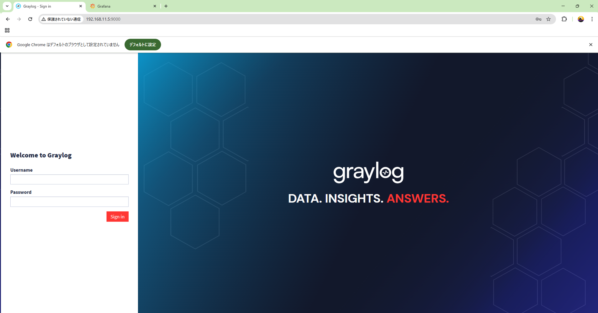
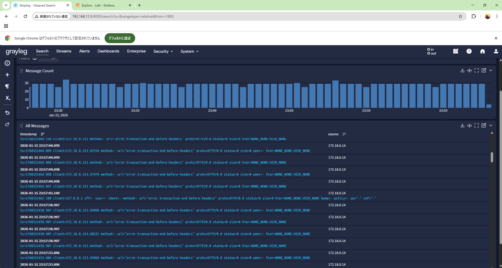
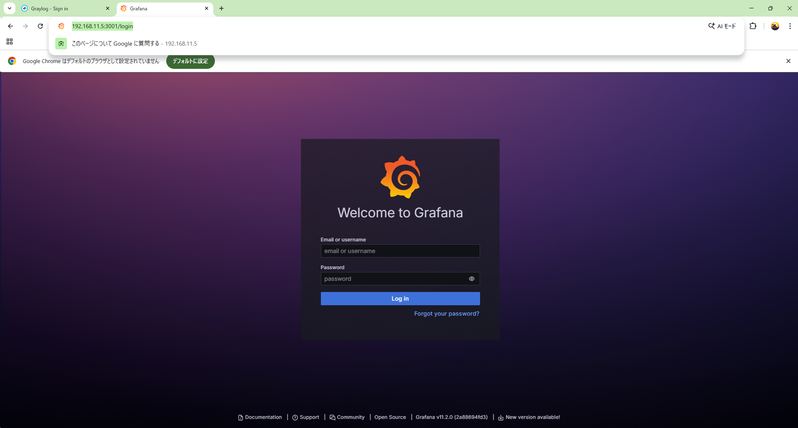
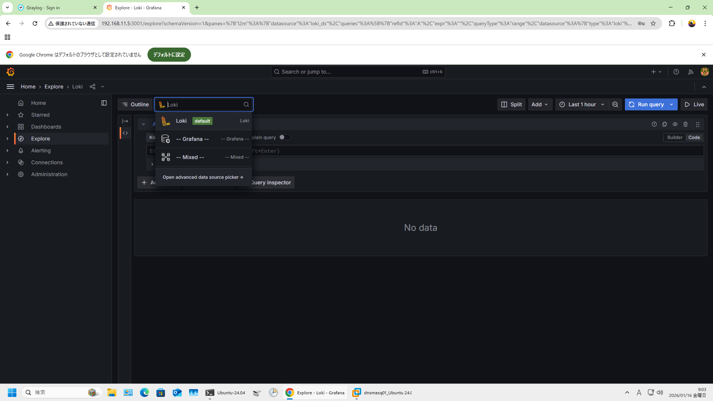
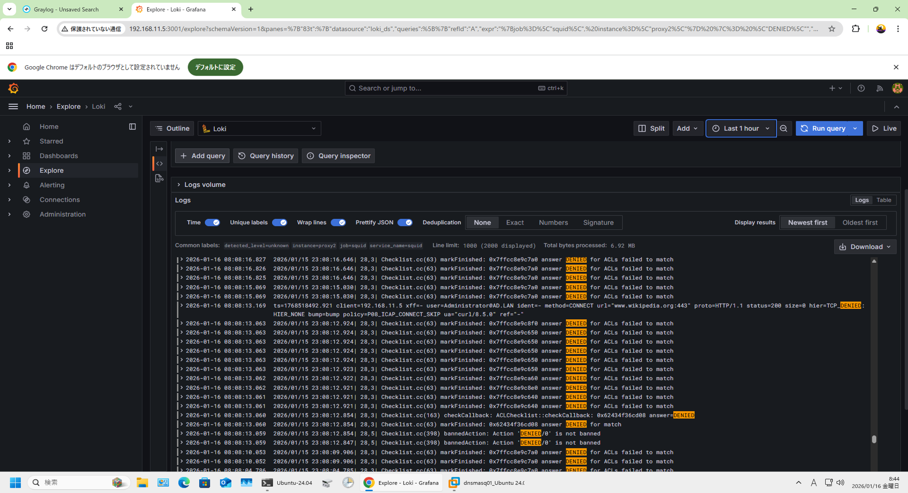

# Automation（構築・検証・可視化の自動化）

本ドキュメントでは、本プロジェクトにおける  
**構築・起動・検証・復旧・監視可視化までを一貫して担う自動化**について整理します。

本プロジェクトで重視したのは、  
**「一度動いた環境」ではなく「何度でも同じ状態まで再現でき、かつ“動いていることを証明できる”環境」**です。

---

## 0. この Automation で何を証明しているか（結論）

この Automation によって、以下を証明しています。

- 環境を破棄しても、同一構成を何度でも再構築できる
- 途中失敗時に「どの STEP で止まり、次に何を見るべきか」が分かる
- 再構築後に、通信・認証・ログ・監視が可視化された状態まで自動で到達できる

つまり、

「構築できる」ではなく  
**「運用・検証できる状態まで再現できる」**

ことを目的とした Automation です。

---

## 1. 自動化の設計思想

自動化にあたり、以下を方針としました。

- 手作業を前提としない
- 実行順を迷わせない（STEP番号で順序を固定）
- 失敗時に「どこで止まったか」が分かる
- 結果が logs/ に残り、後から追える
- GUI（Zabbix / Graylog / Grafana）でも確認できる状態まで到達する

完全なワンコマンド化よりも、

**構成や責務が理解でき、失敗時に切り分けできる自動化**

を優先しています。

---

## 2. 再現にかかる時間と到達点

### 再現にかかる時間（目安）

- 環境破棄後の再構築：約 25分
    - コンテナ起動
    - 初期設定
    - 認証・通信・監視の有効化
    - ヘルスチェック完了まで

※ 実行環境・マシンスペックにより多少前後します。

### 到達点（Automation のゴール）

- Proxy / Kerberos / ICAP / LDAP が成立している
- ログが Loki / Graylog に集約されている
- 監視が Zabbix に自動登録され、GUI 上で確認できる

---

## 3. スクリプト構成（概要）

| 種別 | スクリプト例 | 役割 |
|---|---|---|
| ALL-IN-ONE | all_in_one_rebuild_and_health.sh | クリア → 初期化 → 起動 → ヘルス確認（STEP0〜17） |
| ヘルスチェック | scripts/multiproxy_health_all.sh など | 全コンテナの稼働状態・依存関係確認 |
| ブートストラップ | 各種 bootstrap_* など | 構成単位ごとの初期化・起動 |
| 再起動制御 | scripts/restart_chain_proxy.sh など | Proxy / stunnel の安全な再起動（依存順序を考慮） |
| 監視自動化 | zbx_psk_allinone.sh など | Zabbix 自動登録・PSK設定・初期設定 |

各スクリプトは **単体実行可能**かつ  
ALL-IN-ONE からも呼び出せる構成です。

---

## 4. ALL-IN-ONE の使い方（部分実行を含めて解説）

本プロジェクトの ALL-IN-ONE は  
`all_in_one_rebuild_and_health.sh` を中心に実行します。

### 基本（全 STEP 実行）

    ./all_in_one_rebuild_and_health.sh

### STEP 一覧を表示（実装している場合）

    ./all_in_one_rebuild_and_health.sh --list

### 途中から最後まで（例：STEP7から）

    ./all_in_one_rebuild_and_health.sh --from 7

### 途中まで実行（例：STEP13まで）

    ./all_in_one_rebuild_and_health.sh --to 13

    ./all_in_one_rebuild_and_health.sh --from 6 --to 10

### 特定 STEP のみ実行（例：STEP14のみ）

    ./all_in_one_rebuild_and_health.sh --only 14

### 複数 STEP を指定実行

    ./all_in_one_rebuild_and_health.sh --steps 0,1,7,8,14

---

## 5. エラー時の判断指針（ログの見方）

本 Automation では  
**「エラーが出たら、どのログを見るか」**を明確にしています。

| 症状 | 確認するログ |
|---|---|
| Proxy 起動失敗 | logs/bootstrap_proxy*.log |
| 認証失敗 | kinit / Kerberos 関連ログ |
| 通信不可 | stunnel / squid logs |
| ログが出ない | promtail / graylog health |
| 監視未反映 | logs/step17_zbx_psk_allinone_*.log |

画面には要点のみを表示し、  
**詳細調査はログを見る設計**としています。

---

## 6. 可視化（Automation の最終成果）

Automation のゴールは「起動完了」ではありません。

- Graylog：Proxy ログを検索できる
- Grafana（Loki）：ログを時系列に追跡できる
- Zabbix：ホストが自動登録され、監視できている

**再現後の“動作証明”まで自動化している点**が特徴です。

---

## 6-1. 動作証明（可視化の証跡集）

このセクションでは、Automation 実行後に  
**「動いていることを第三者が確認できる証跡」**をまとめます。

---

### A. ALL-IN-ONE 実行結果（サマリ）

- 目的：STEP0〜17 が完走し、構築〜監視まで到達したことを示す
- 画像リンク：[`./images/all_in_one_rebuild_and_health.png`](./images/all_in_one_rebuild_and_health.png)

<!-- 画像：見やすさ（余白/枠/影）＋タップで原寸（新規タブ） -->
<figure style="margin: 1.2em auto; text-align:center;">
  
  <figcaption style="margin-top:.6em; font-size:.92em; opacity:.85;">
    クリック/タップで原寸表示（別タブ）。
    <strong>構築→初期化→起動→ヘルス確認までを一気通しで完走</strong>した証跡です（STEP0〜17）。
  </figcaption>
</figure>

---

### B. 正常性確認結果（health / up & health）

- 目的：起動できた「だけ」でなく、ヘルスチェックに合格していることを示す
- 画像リンク：[`./images/healthcheck-output.png`](./images/healthcheck-output.png)

<!-- 画像：見やすさ（余白/枠/影）＋タップで原寸（新規タブ） -->
<figure style="margin: 1.2em auto; text-align:center;">
  
  <figcaption style="margin-top:.6em; font-size:.92em; opacity:.85;">
    クリック/タップで原寸表示（別タブ）。
    <strong>依存関係込みで “運用可能（healthy）” に到達</strong>していることを示します。
  </figcaption>
</figure>

---

### C. Zabbix GUI（監視が自動登録されている証明）

- 目的：スクリプト実行だけで監視が成立していることを GUI で示す
- 画像リンク：
  - [`./images/zabbix-hosts.png`](./images/zabbix-hosts.png)
  - [`./images/zabbix-proxy1-latest.png`](./images/zabbix-proxy1-latest.png)

<!-- 画像：見やすさ（余白/枠/影）＋タップで原寸（新規タブ） -->
<figure style="margin: 1.2em auto; text-align:center;">
  
  <figcaption style="margin-top:.6em; font-size:.92em; opacity:.85;">
    クリック/タップで原寸表示（別タブ）。
    <strong>zbx_psk_allinone.sh によりホストが自動登録</strong>されていることを確認します。
  </figcaption>
</figure>

<!-- 画像：見やすさ（余白/枠/影）＋タップで原寸（新規タブ） -->
<figure style="margin: 1.2em auto; text-align:center;">
  
  <figcaption style="margin-top:.6em; font-size:.92em; opacity:.85;">
    クリック/タップで原寸表示（別タブ）。
    <strong>「登録できた」だけでなく “監視できている”</strong>（Latest data 更新）を示します。
  </figcaption>
</figure>

---

### D. Proxy1 コンテナの監視項目（Zabbix 側の観測点）

- 目的：Proxy1 をどの観測点で監視しているかを示し、
        運用時に“何を見て正常／異常を判断するのか”を具体化する
- 画像リンク：[`./images/zabbix-proxy1-items.png`](./images/zabbix-proxy1-items.png)

<!-- 画像：見やすさ（余白/枠/影）＋タップで原寸（新規タブ） -->
<figure style="margin: 1.2em auto; text-align:center;">
  
  <figcaption style="margin-top:.6em; font-size:.92em; opacity:.85;">
    クリック/タップで原寸表示（別タブ）。
    <strong>コンテナ稼働・プロセス・疎通</strong>など、運用で効く観測点を例示します。
  </figcaption>
</figure>

---

### E. Graylog（GUI にアクセスでき、ログが閲覧できることの証明）

- 目的：Graylog の **Web UI にアクセスできる**／**ログ（Search結果）が表示できる**状態であることを示す  
  （※このセクションでは「検索式や解析」までは踏み込まず、**GUI 到達＋ログ閲覧できる**ことだけを証跡化します）

- 証跡
  - `./images/graylog-gui-access.png`（Graylog のトップ/ダッシュボードが開ける）
  - `./images/graylog-search-result.png`（Search でログ行が表示されている）

- 画像リンク：
  - [`./images/graylog-gui-access.png`](./images/graylog-gui-access.png)
  - [`./images/graylog-search-result.png`](./images/graylog-search-result.png)

<!-- 画像：見やすさ（余白/枠/影）＋タップで原寸（新規タブ） -->
<figure style="margin: 1.2em auto; text-align:center;">
  
  <figcaption style="margin-top:.6em; font-size:.92em; opacity:.85;">
    クリック/タップで原寸表示（別タブ）。Graylog の <strong>Web UI に到達できる</strong>ことを示します（可視化の到達点）。
  </figcaption>
</figure>

<!-- 画像：見やすさ（余白/枠/影）＋タップで原寸（新規タブ） -->
<figure style="margin: 1.2em auto; text-align:center;">
  
  <figcaption style="margin-top:.6em; font-size:.92em; opacity:.85;">
    クリック/タップで原寸表示（別タブ）。Graylog 上で <strong>ログ行が表示される</strong>＝ログ閲覧が可能な状態であることを示します。
  </figcaption>
</figure>

---

### F. Grafana（Loki）（GUI にアクセスでき、ログが閲覧できることの証明）

このセクションも「解析」ではなく、Automation の到達点として  
<strong>Grafana の UI にアクセスでき、Loki をデータソースとしてログが表示できる</strong>ことだけを証跡化します。  
（※Case A / Case B の追跡・LogQL の再現は Verification 側に集約する想定）

- 証跡
  - `./images/grafana-gui-access.png`（Grafana トップが開ける）
  - `./images/grafana-loki-datasource.png`（Loki datasource が有効/選択できる）
  - `./images/grafana-loki-explore-result.png`（Explore でログが表示される）

- 画像リンク：
  - [`./images/grafana-gui-access.png`](./images/grafana-gui-access.png)
  - [`./images/grafana-loki-datasource.png`](./images/grafana-loki-datasource.png)
  - [`./images/grafana-loki-explore-result.png`](./images/grafana-loki-explore-result.png)

<!-- 画像：見やすさ（余白/枠/影）＋タップで原寸（新規タブ） -->
<figure style="margin: 1.2em auto; text-align:center;">
  
  <figcaption style="margin-top:.6em; font-size:.92em; opacity:.85;">
    クリック/タップで原寸表示（別タブ）。Grafana の <strong>Web UI に到達できる</strong>ことを示します（可視化の到達点）。
  </figcaption>
</figure>

<!-- 画像：見やすさ（余白/枠/影）＋タップで原寸（新規タブ） -->
<figure style="margin: 1.2em auto; text-align:center;">
  
  <figcaption style="margin-top:.6em; font-size:.92em; opacity:.85;">
    クリック/タップで原寸表示（別タブ）。Grafana 側で <strong>Loki データソースが利用可能</strong>であることを示します。
  </figcaption>
</figure>

<!-- 画像：見やすさ（余白/枠/影）＋タップで原寸（新規タブ） -->
<figure style="margin: 1.2em auto; text-align:center;">
  
  <figcaption style="margin-top:.6em; font-size:.92em; opacity:.85;">
    クリック/タップで原寸表示（別タブ）。Explore で <strong>ログ行が表示される</strong>＝「Loki にログが入っており閲覧できる」状態を示します。
  </figcaption>
</figure>

---

## まとめ

本プロジェクトの Automation は、

- 環境を破棄しても
- 同じ構成を
- 同じ順序で再構築し
- 同じ結果（通信・認証・ログ・監視）に到達できる

ことを目的に設計されています。

これは単なる構築自動化ではなく、  
**運用・検証・改善を前提とした設計力を示すための取り組み**です。
