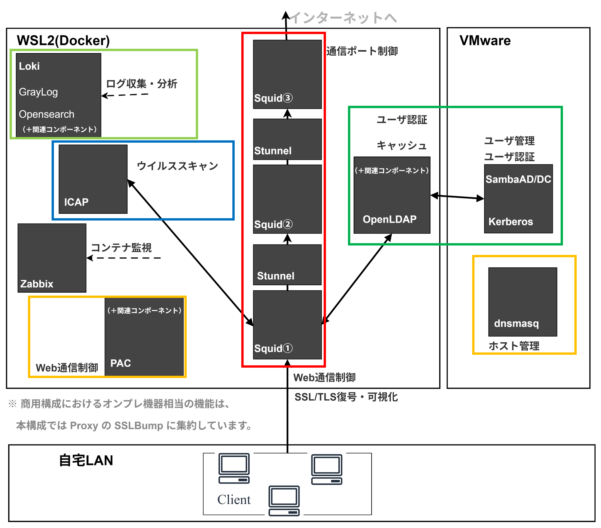
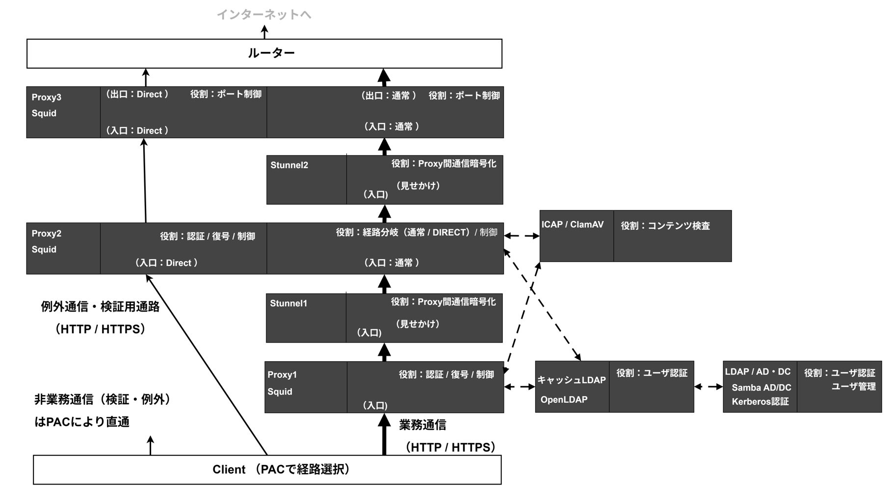
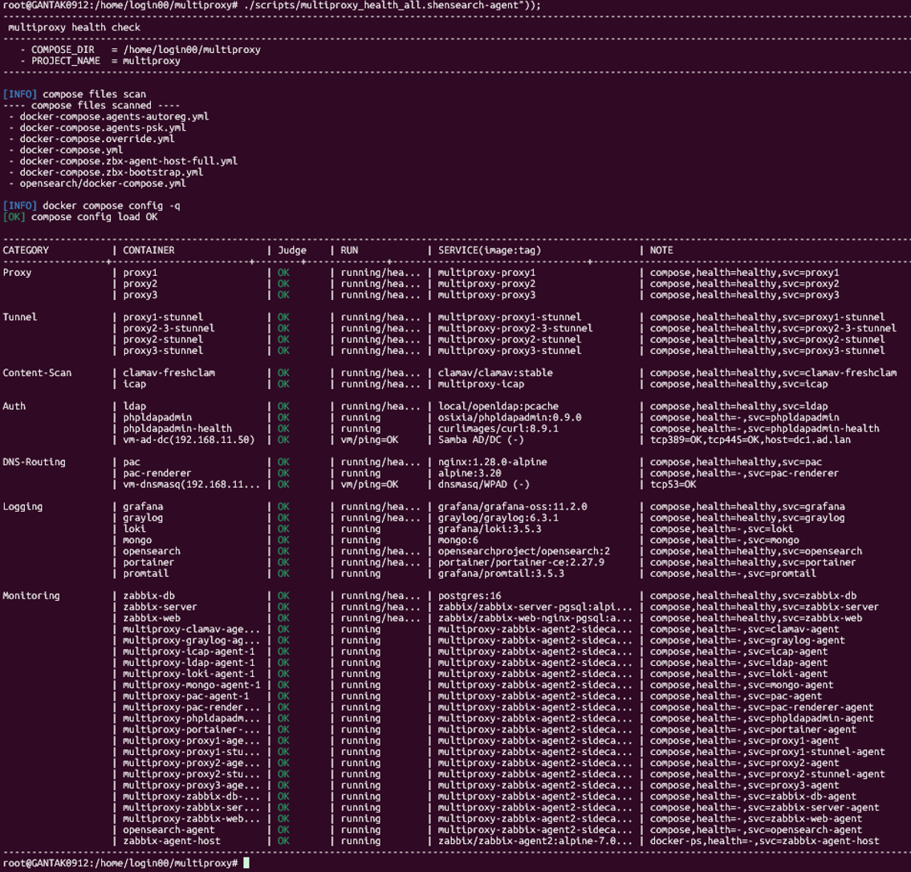

# OSS Multi-Layer Proxy & Authentication System  
── 構築・課題・設計思想まとめ

Version: 2025-02  
Author: gan2

---

## 1. プロジェクト概要（Summary）

本プロジェクトは、実務で扱う **多段プロキシ／認証基盤／ログ基盤／監視基盤** を題材に、  
**WSL2 × Docker × VMware × OSS のみ** を用いて  
**商用品質のネットワーク・セキュリティ基盤をゼロから構築** した個人ポートフォリオです。

単なる構築手順の再現ではなく、  
**通信経路・ログ・失敗事例を通じて「なぜこの設計が必要か」を理解すること**を目的としています。

### **主要コンセプト**
- 商用設定のコピーは絶対に行わない（構造から自作）
- 実務トラブルを **再現 → 可視化 → 理解 → 改善**
- SSL/TLS・認証・経路制御の設計思想を体系的に理解
- 「操作できる人」ではなく「設計できるエンジニア」を目指す


---

## 2. システムアーキテクチャ（全体像）

本章では、本プロジェクトで構築したシステム全体の構成を示します。

左図は、**実務で運用しているネットワーク・セキュリティ基盤の構成**を参考として整理したものです。  
各サーバ上で、商用のプロキシ・認証・ログ・監視サービスが稼働しています。

右図は、左図と**同じ役割・責務を持つ構成**を、  
OSS を用いて **自身で設計・実装した構成**を示しています。

商用サービスが提供している機能をそのまま置き換えるのではなく、  
OSS 単体で成立しない部分については、  
必要なコンポーネントを追加することで機能を補完しています。



### 構成要素（すべて OSS）

<div class="table-compact" id="stack-table">
  <strong>構成要素（すべて OSS）</strong>

  <div class="table-wrap">
    <table>
      <thead>
        <tr>
          <th>区分</th>
          <th>役割・位置づけ</th>
          <th>採用技術</th>
        </tr>
      </thead>
      <tbody>
        <tr>
          <td>プロキシ</td>
          <td>入口／分岐／出口の3段構成による通信制御</td>
          <td>Squid（3段、経路別ポート設計）</td>
        </tr>
        <tr>
          <td>中継暗号化</td>
          <td>Proxy 間通信の TLS 化（中継区間の暗号化）</td>
          <td>stunnel（Proxy1→2 / Proxy2→3）</td>
        </tr>
        <tr>
          <td>コンテンツ検査</td>
          <td>ウイルス・コンテンツ検査（横断機能）</td>
          <td>ICAP / ClamAV</td>
        </tr>
        <tr>
          <td>認証</td>
          <td>ユーザ認証・認可（SSO）</td>
          <td>OpenLDAP / Samba AD/DC / Kerberos</td>
        </tr>
        <tr>
          <td>DNS / 経路制御</td>
          <td>PAC 配布・名前解決</td>
          <td>dnsmasq（WPAD / Split DNS）</td>
        </tr>
        <tr>
          <td>ログ</td>
          <td>アクセス・通信ログの集中管理</td>
          <td>Promtail / Loki / Graylog / OpenSearch</td>
        </tr>
        <tr>
          <td>監視</td>
          <td>稼働・性能の可視化</td>
          <td>Zabbix（TLS-PSK + Sidecar）</td>
        </tr>
        <tr>
          <td>自動化</td>
          <td>起動・検証・復旧の再現性確保</td>
          <td>Bash</td>
        </tr>
        <tr>
          <td>実行環境</td>
          <td>検証用基盤</td>
          <td>Ubuntu 24.04（WSL2 mirrored mode）</td>
        </tr>
      </tbody>
    </table>
  </div>
</div>

<p class="note"><em>
※ 左図で実務上まとめて提供されている機能を、右図では OSS を用いて役割単位に分けて構成しています。
</em></p>

---

## ✅ 動作検証（スクリーンショット集）

**実際に動作している証拠（スクショ／ログ）**も合わせて提示しています。

- テストの観点（P1〜P13）
- 経路別 SSLBump（通常：Proxy1 / DIRECT：Proxy2）の証拠
- stunnel による中継TLSの証拠
- AD / LDAP / Kerberos の疎通・ユーザ可視化
- Graylog / Loki / Zabbix による可観測性

📌 **検証ページはこちら**：  
- [Verification（検証観点 & スクショ一覧）](./verification.html)


---

## 3. 通信経路とポート設計（構成変更点）

本構成は「通常経路（Proxy1 経由）」と「DIRECT 経路（Client→Proxy2 直）」の2系統です。  
Proxy2 が分岐点（3129=通常 / 3131=DIRECT）で、Proxy間は stunnel により TLS 中継します。  
ログはポート単位で分離し、障害時に追跡しやすい設計です。

※ 通信経路を 2 系統（通常 / DIRECT）に分離することで、  
   業務通信（通常）と例外的・検証用途の通信（DIRECT）の責務を明確化し、  
   障害時の切り分けやログ追跡を容易にする設計としています。  
   また、DIRECT 経路は将来的に仮想ブラウザ等を用いた  
   高リスクサイト閲覧向け経路として拡張可能な構成としています。



- 通常経路：Client → Proxy1:3128 → Proxy2:3129 → Proxy3:3130
- DIRECT：Client → Proxy2:3131 → Proxy3:3132


<details>
<summary>付録：stunnel を含む詳細ポート（運用者向け）</summary>

- Proxy1→Proxy2：13128 → 4431(TLS) → 3129
- Proxy2→Proxy3：23129 → 4433(TLS) → 3130
- Proxy2→Proxy3(DIRECT)：23131 → 4434(TLS) → 3132

</details>

---

## 4. 設計補足（通信制御に関する考慮点）

本章では、3章で示した通信構成について、  
**設計時に考慮した制約や判断ポイントを補足**します。

---

### 4-1. 復号（SSLBump）位置の整理

HTTPS 通信の復号は、  
**1 通信につき 1 箇所でのみ成立する**という前提があります。

この制約を踏まえ、本構成では  
復号処理を「入口となるプロキシ」に集約し、  
中継プロキシでは再復号を行わない設計としています。

- 通常経路：Proxy1 で復号 , Proxy2 で復号除外
- DIRECT 経路：Proxy2 で復号

この整理により、  
多段構成でも TLS の整合性を保った通信が成立します。

---

### 4-2. プロキシ間通信の暗号化

プロキシ間の中継通信については、  
**通信区間の安全性と境界の明確化**を目的として  
stunnel により TLS 化しています。

Squid 単体では担えない暗号化処理を中継層に分離することで、  
構成の見通しと将来的な拡張性を確保しています。

---

### 4-3. ネットワーク前提条件

Kerberos・DNS・WPAD の検証を行うため、  
L2 が分断されない構成を前提としています。

この要件を満たすため、  
WSL2 の mirrored モードを採用しています。

---

※ これらの設計判断に至る過程で直面した課題や試行錯誤については、  
次章「苦労した点と解決アプローチ」にて詳述します。


---

## 5. 苦労した点と解決アプローチ

本章では、構築・検証の過程で直面した課題と、  
その原因をどのように切り分け、理解・解決に至ったかを整理します。

商用環境では前提として隠れている挙動についても、  
OSS 環境では自ら確認・整理する必要がありました。

---

### 5-1. プロキシ間通信の暗号化が必要だと理解するまで

初期段階では、  
「Docker 内部通信であれば平文でも問題ないのではないか」  
という前提で構成を検討していました。

しかし検証を進める中で、以下の点が問題となりました。

- Squid は復号後の HTTP 通信を再暗号化できない
- コンテナ内部であっても、権限取得時の盗聴リスクは排除できない
- 中継区間が平文であることが構成上明示されてしまう

これらを踏まえ、  
**プロキシ間通信の暗号化責務を Squid から切り離し、  
stunnel に分離する構成が妥当である**と判断しました。

---

### 5-2. 多段 SSLBump が成立しない理由の理解

一時期、以下のような構成を試しました。
Proxy1（SSLBump） → Proxy2（SSLBump） → Proxy3


しかし、この構成では HTTPS 通信が正常に成立しませんでした。

調査の結果、

- 一度 MITM を行った時点で、TLS の文脈が完結している
- 後段で再度 MITM を試みると、TLS ハンドシェイクが破綻する

という HTTPS の前提仕様に起因する問題であることが分かりました。

この失敗を通じて、  
**SSLBump は 1 通信につき 1 回しか成立しない**  
という制約を実体験として理解しました。

---

### 5-3. 認証基盤（AD / LDAP / Kerberos）の切り分け

認証が失敗する際、  
「どのレイヤで問題が発生しているのか」を  
切り分けることに苦労しました。

検証を通じて、以下の点を段階的に整理しました。

- SPN / keytab が参照されるタイミング
- CN / SAN 不一致による認証失敗
- Kerberos が時刻同期に強く依存する理由
- LDAP 検索範囲と属性の関係

結果として、  
**認証失敗を“結果”ではなく“発生レイヤ”で捉えられるようになった**  
ことが大きな変化でした。


---

## 6. ログ・監視（Observability）

※ 本章は現在調整中の領域であり、  
※ 現時点では GUI 上でのログ確認および監視項目の基本動作確認までを実施しています。  
※ Zabbix についても、コンテナ起動後に想定した監視が動作していることを確認済みです。

本構成では、多段プロキシ環境の挙動を把握するため、  
ログ収集および監視基盤を段階的に導入しています。

---

### 現在確認できている構成

| 種類 | 内容 |
|------|------|
| アクセスログ | Squid → Loki / Graylog |
| 接続ログ | stunnel / Squid / DNS / Kerberos |
| 監視 | Zabbix（TLS-PSK + Sidecar Agent） |
| 可視化 | Grafana / Kibana |

---

### 現時点で把握できていること

現段階では、以下の点について  
**ログや監視画面上での確認が可能**な状態となっています。

- 経路ごとの通信ログが分離されていること
- stunnel を含む中継通信の接続ログが取得できていること
- Zabbix Agent が各コンテナで稼働していること
- GUI 上でログおよびメトリクスを参照できること

---

### 今後の検証・調整予定

ログと監視の活用については、  
今後以下の観点で深掘り・調整を進める予定です。

- 多段プロキシ構成における遅延の定量比較
- ICAP 処理によるレスポンス影響の可視化
- PAC による経路差異のログベース分析
- Kerberos 認証失敗時の発生レイヤ特定

これらを通じて、  
**構成理解だけでなく、運用判断に使える可観測性**の整理を目指します。

---

## 8. 自動化（運用性・再現性の確保）

本環境では、構成変更後の確認や障害時の復旧を手順化し、  
**手動ミスを減らしつつ、短時間で再現できる運用**を目指して自動化しています。

### 自動化している主な内容

- コンテナ群の一括起動・初期化・稼働確認（まとめて実行）
- 全コンテナの稼働状態を一括確認するヘルスチェック  
  - `scripts/multiproxy_health_all.sh`
- 監視（Zabbix）の自動登録・初期設定（オートプロビジョニング）
- 主系（Proxy）コンテナの安全な再起動（依存関係を考慮）  
  - `scripts/restart_chain_proxy.sh`



詳細は `automation.html` を参照してください。

---

## 9. 学習成果（本プロジェクトを通じて得られた理解）

本プロジェクトを通じて、以下の観点について理解が深まりました。

### 通信・暗号化設計
- SSLBump の技術的制約と復号範囲の設計
- TLS 再暗号化における役割分担（Proxy / stunnel）

### ネットワーク制御
- PAC / WPAD を用いた企業ネットワークでの経路制御の重要性
- Kerberos 認証の内部処理と前提条件

### 運用・可観測性
- 時系列ログを用いた通信挙動の分析
- 再現性と自動化を前提とした運用設計の価値

---

## 10. まとめ（企業が見たい“強み”）

本プロジェクトは単なる構築練習ではなく、  
**通信・認証・運用を含む複合的な構成を、OSS を用いて設計・検証したエンジニアリング成果**です。

### 本プロジェクトを通じて培った能力

- レイヤを跨いだ通信全体の構造理解
- OSS を用いて構成を設計・構築する力
- トラブルを再現し、原因を切り分けて理解する問題分析力
- 再現性・自動化・標準化を意識した SRE 的な思考

---

## 11. 画像テンプレ（必要に応じて参照）

```md


## 11. 今後の展望（Next Steps）

本構成は検証・理解を目的としたオンプレミス／ローカル環境での再現を主眼としていますが、  
今後は以下の観点で発展させていくことを想定しています。

---

### 11-1. AWS 環境への移行

現在の構成をベースに、AWS 上での再構築を検討しています。

- EC2 / ALB / NLB を用いたプロキシ配置
- VPC / Subnet / Security Group を含めたネットワーク設計
- オンプレミス前提だった DNS / 認証 / 通信境界の再整理

ローカル環境で明示的に分解した設計要素を、  
**クラウド環境にどう適用・再設計するか**を検証対象とします。

---

### 11-2. SDD を用いた AI 駆動開発との掛け合わせ

仕様駆動開発（SDD）を取り入れ、  
設計・設定・検証を **AI と協調しながら進める開発スタイル**の検証を行います。

- 設計意図を仕様として明文化
- 仕様をもとにした設定生成・レビュー支援
- 変更時の影響範囲整理や再設計支援

インフラ構成を「人の記憶」ではなく  
**仕様として管理するアプローチ**への発展を目指します。

---

### 11-3. 監視項目のチューニング

現在は基本的な死活・性能監視を中心としていますが、  
今後は以下のような観点で監視の精度を高めていく予定です。

- 経路別レイテンシ・エラー率の可視化
- SSLBump / 認証失敗の兆候検知
- ログとメトリクスを組み合わせた原因特定

「見える」だけでなく  
**判断に使える監視**を目標とします。

---

### 11-4. 冗長化構成の検討

現状は設計理解を優先した単一構成ですが、  
将来的には冗長化も検証対象とします。

- Proxy / stunnel の冗長化
- フェイルオーバー時の挙動確認
- PAC / DNS と連携した経路切替

これにより、  
**可用性を含めた商用運用に近い検証**へ発展させる予定です。
