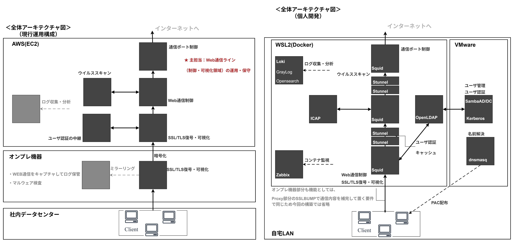

# OSS Multi-Layer Proxy & Authentication System  
── 構築・課題・設計思想まとめ

Version: 2025-01-15  
Author: gan2

---

## このポートフォリオで伝えたいこと

### ✅ 目的（最重要）
- 実務では障害解析が **ベンダー回答に依存**しやすく、**設計意図・原因**を自分の言葉で説明しづらい場面がある  
- そこで、入口〜出口までを OSS で構築し、**挙動をログ根拠で説明できる状態**を目指した

### ✅ 設計の軸（責務分離）
- **入口／分岐／出口（経路制御）**
- **認証**
- **検査**
- **ログ（可観測性）**

> 実務で扱った構成を参考にしつつ、  
> **自分が知らない環境でも再現・検証できる形**に分解して設計しています。

### ✅ 検証で重視したこと（俯瞰の切り分け）
- 分業で局所的になりがちな原因究明を、**入口〜出口まで俯瞰して切り分けできる状態**にする  
- **暗号化（SSLBump / stunnel）・認証（Kerberos）・経路制御・ログ**を一気通貫で検証し、設計意図まで説明できるよう整理した

### ✅ 運用視点（再現性）
- 起動〜正常性確認〜初期設定までをスクリプト化  
- **スクリプト実行だけで約25分で環境を再現可能**

▶ 全体像： [システムアーキテクチャ](#2-システムアーキテクチャ全体像)  
▶ 動作証跡： [動作検証（スクリーンショット集）](#-動作検証スクリーンショット集)  
▶ 深掘り： [設計補足](#4-設計補足通信制御に関する考慮点) / [苦労した点](#5-苦労した点と解決アプローチ)  
▶ 到達点： [本プロジェクトで得た設計力・運用視点](#9-まとめ)

---

  
<strong>補足：このポートフォリオの位置づけ（クリックで開く）</strong>

  <ul>
    <li><strong>位置づけ:</strong> 実務で扱う構成を題材にした <strong>個人OSS開発（ポートフォリオ本体）</strong></li>
    <li><strong>狙い:</strong> 通信・認証・暗号化・ログを <strong>俯瞰して切り分けできる設計力</strong> を身につける</li>
    <li><strong>根拠:</strong> 以降の章で <strong>図面・ログ・検証結果</strong> を用いて説明します</li>
  </ul>

---

## 目次

- [1. プロジェクト概要（Summary）](#1-プロジェクト概要summary)
- [2. システムアーキテクチャ（全体像）](#2-システムアーキテクチャ全体像)（構成図）
- [✅ 動作検証（スクリーンショット集）](#-動作検証スクリーンショット集)（証拠）
- [3. 通信経路と設計（構成変更点）](#3-通信経路と設計構成変更点)（経路設計）
- [4. 設計補足（通信制御に関する考慮点）](#4-設計補足通信制御に関する考慮点)（設計判断）
- [5. 苦労した点と解決アプローチ](#5-苦労した点と解決アプローチ)（切り分け）
- [6. ログ・監視（Observability）](#6-ログ監視observability)（可観測性）
- [7. 自動化（運用性・再現性の確保）](#7-自動化運用性再現性の確保)（25分再現）
- [8. 学習成果](#8-学習成果本プロジェクトを通じて得られた理解)（学び）
- [9. まとめ](#9-まとめ)（到達点）
- [10. 今後の展望（Next Steps）](#10-今後の展望next-steps)

---

## 1. プロジェクト概要（Summary）

本プロジェクトは、実務で扱う **多段プロキシ／認証基盤／ログ基盤／監視基盤** を題材に、  
**WSL2 × Docker × VMware × OSS** を用いて、同等の役割・責務を持つ構成を **ゼロから設計・構築**した個人ポートフォリオです。

目的は単に動かすことではなく、  
**通信経路・認証・暗号化・ログ**を根拠に「なぜそうなるか」を説明できる状態を作ることです。

### 主要コンセプト
- 商用設定のコピーは絶対に行わず、**構造と責務から自作**
- 実務で扱う構成を題材に **再現 → 可視化 → 理解 → 設計改善**
- SSL/TLS・認証・経路制御を **設計判断として体系化**
- 「操作できる人」ではなく **設計できるエンジニア** を目指す

  
<strong>補足：この章の見どころ（クリックで開く）</strong>

  <ul>
    <li>全体像は <strong>「構成図」</strong> で示し、動作は <strong>「検証（スクショ/ログ）」</strong> で裏付けます</li>
    <li><strong>“できた”</strong>よりも、<strong>“切り分けできる”</strong>ことを重視して整理しています</li>
  </ul>

---

## 2. システムアーキテクチャ（全体像）

この章では、本プロジェクトの全体構成を **「実務環境（参考）」と「OSSで再現した構成」** で比較します。  
目的は、商用環境で一体化しやすい機能を **役割（責務）単位に分解し、切り分け可能な構造にすること**です。

---

### ✅ 構成比較（実務環境 ↔ OSS再現）

> **左：実務環境（参考）**
> **右：OSS再現** … 入口/分岐/出口・認証・暗号化・検査・ログを分解した構成

<!-- ✅ 図面はタップで原寸表示 -->

  <!-- 切り替え（JSなし：radioで実現） -->
  <input class="cmp-radio" type="radio" name="cmp" id="cmp-both" checked>
  <input class="cmp-radio" type="radio" name="cmp" id="cmp-left">
  <input class="cmp-radio" type="radio" name="cmp" id="cmp-right">

  

    <label for="cmp-both" class="cmp-btn">両方</label>
    <label for="cmp-left" class="cmp-btn">左（参考）</label>
    <label for="cmp-right" class="cmp-btn">右（OSS再現）</label>
  

  <!-- 画像は「同じ1枚」を2回重ねる -->
  

    

    

    <!-- ✅ 非フォーカス側を“背景と同化”させる覆い -->
    

    <!-- ✅ 左右の境界線（任意） -->
    
  

  <!-- 任意：補足文を付けるなら -->
  <!-- 
※ ボタンで左右にフォーカス（画像は1枚のまま）
 -->

※ 画像をタップすると原寸で確認できます

---

  
<strong>構成要素（すべて OSS）※クリックで開く</strong>

  

    

      <table>
        <thead>
          <tr>
            <th>区分</th>
            <th>役割・位置づけ</th>
            <th>採用技術</th>
          </tr>
        </thead>
        <tbody>
          <tr>
            <td>プロキシ</td>
            <td>入口／分岐／出口の3段構成による通信制御</td>
            <td>Squid（3段、経路別ポート設計）</td>
          </tr>
          <tr>
            <td>中継暗号化</td>
            <td>Proxy 間通信の TLS 化（中継区間の暗号化）</td>
            <td>stunnel（Proxy1→2 / Proxy2→3）</td>
          </tr>
          <tr>
            <td>コンテンツ検査</td>
            <td>ウイルス・コンテンツ検査（横断機能）</td>
            <td>ICAP / ClamAV</td>
          </tr>
          <tr>
            <td>認証</td>
            <td>ユーザ認証・認可（SSO）</td>
            <td>OpenLDAP / Samba AD/DC / Kerberos</td>
          </tr>
          <tr>
            <td>DNS / 経路制御</td>
            <td>PAC 配布・名前解決</td>
            <td>dnsmasq（WPAD / Split DNS）</td>
          </tr>
          <tr>
            <td>ログ</td>
            <td>アクセス・通信ログの集中管理</td>
            <td>Promtail / Loki / Graylog / OpenSearch</td>
          </tr>
          <tr>
            <td>監視</td>
            <td>稼働・性能の可視化</td>
            <td>Zabbix（TLS-PSK + Sidecar）</td>
          </tr>
          <tr>
            <td>自動化</td>
            <td>起動・検証・復旧の再現性確保</td>
            <td>Bash</td>
          </tr>
          <tr>
            <td>実行環境</td>
            <td>検証用基盤</td>
            <td>Ubuntu 24.04（WSL2 mirrored mode）</td>
          </tr>
        </tbody>
      </table>
    

  

  
<strong>補足：責務分離の狙い（クリックで開く）</strong>

  <ul>
    <li>
      <strong>入口／分岐／出口</strong>を分けることで、
      「どこで・何が・なぜ起きたか」をログと挙動から追いやすくする
    </li>
    <li>
      <strong>認証・暗号化・検査・ログ</strong>を独立させ、
      障害発生時に責務単位で俯瞰・切り分けできる構造にする
    </li>
    <li>
      <strong>商用プロキシに近い要件・振る舞い</strong>を持つシステムを、
      自身が事前に把握していない環境条件の中で、
      <strong>OSSのみを用いて一から設計・構築・検証できる力を身につける</strong>
    </li>
  </ul>

---

## ✅ 動作検証（スクリーンショット集）

本プロジェクトでは、**実際に動作している証拠（スクリーンショット／ログ）**を  
目的別に 2 つのドキュメントに分けて整理しています。

- 経路制御・復号・中継TLSなどの **要点を確認するページ**
- 同じ内容を **第三者が再現できる粒度で整理した詳細版（Runbook）**

---

### 📌 検証ページ（要点）

- [Verification](./verification.html)

**確認できる内容**
- 全体稼働と構成図の一致
- 経路別 SSLBump（通常：Proxy1 / DIRECT：Proxy2）
- stunnel によるプロキシ間 TLS
- ログ基盤（Loki）を用いた切り分けの流れ

---

### 📌 検証ページ（詳細・再現用）

- [verification_detail.md](./verification_detail.html)

**確認できる内容**
- 試験ID（P1〜）単位の検証観点
- 実行コマンド／判定基準／取得すべき証跡の明示
- PAC 経路差・SSLBump・stunnel・認証（AD / LDAP / Kerberos）の個別検証
- Loki を用いたログ追跡と原因特定の具体手順

---

  
<strong>補足：読みどころ（クリックで開く）</strong>

  <ul>
    <li>
      <strong>Verification</strong> は
      「設計どおりに動いているか」を短時間で確認するための要点版です
    </li>
    <li>
      <strong>verification_detail.md</strong> は
      「なぜそう判断できるのか」を再現可能な形で示す詳細版です
    </li>
    <li>
      単に “動いた” ではなく、
      <strong>ログ・画面・経路差</strong>から根拠を説明できる構成にしています
    </li>
  </ul>

---

## 3. 通信経路と設計（構成変更点）

本構成は「通常経路（Proxy1 経由）」と「DIRECT 経路（Client→Proxy2 直）」の **2 系統**です。  
Proxy2 を分岐点とし、通常（port:3129）／DIRECT（port:3131）で受け付けます。  
Proxy 間は stunnel で TLS 中継し、ログは経路ごとに分離しています。

<!-- ✅ 図面はタップで原寸表示 -->

  

※ 画像をタップすると原寸で確認できます

<ul>
  <li>通常経路：Client → Proxy1 → Proxy2 → Proxy3</li>
  <li>DIRECT：Client → Proxy2 → Proxy3</li>
</ul>

※ ポート番号は実装の都合であり、目的は「経路・責務・暗号化境界を分離して追跡性を上げる」ことです。

---

## 4. 設計補足（通信制御に関する考慮点）

> この章では「なぜその設計にしたか」を補足します。  
> **結論だけ読めば理解できる**よう、詳細は折りたたみにしています。

---

### 4-1. 復号（SSLBump）位置の整理

✅ **結論：SSLBump（中間者としての復号）は 1通信につき1回しか成立しないため、復号ポイントを分離しました。**

<ul>
  <li>通常経路：<strong>Proxy1 で復号</strong>（Proxy2 は復号除外）</li>
  <li>DIRECT 経路：<strong>Proxy2 で復号</strong></li>
</ul>

  
<strong>詳細：なぜ多段SSLBumpが成立しないのか（クリックで開く）</strong>

  <ul>
    <li>
      HTTPS 復号（SSLBump）は TLS 通信に対して  
      <strong>通信途中でサーバ・クライアント双方を代理する「中間者方式の復号」</strong>
      に該当します。
    </li>

    <li>
      同一通信に対して後段のプロキシでも復号を行うと、  
      <strong>すでに終端された TLS セッションを再度終端しようとすることになり、  
      TLS の前提構造が破綻して通信が成立しません</strong>。
    </li>

    <li>
      そのため本構成では、復号（SSLBump）処理は
      <strong>入口となるプロキシでのみ実施</strong>しています。  
      中継側のプロキシでは SSLBump による再復号は行わず、
      <strong>Proxy 間の通信路は stunnel により TLS で暗号化</strong>した上で、
      <strong>プロキシ内部では平文の HTTP として中継・転送</strong>する設計としています。
    </li>
  </ul>

---

### 4-2. プロキシ間通信の暗号化

✅ **結論：中継区間の暗号化は Squid ではなく stunnel に分離し、境界を明確にしました。**

<ul>
  <li>Proxy 間通信は <strong>TLS（stunnel）で中継</strong></li>
  <li>平文区間は <strong>Proxy ⇄ stunnel のローカル区間に限定</strong></li>
</ul>

  
<strong>詳細：なぜ stunnel に分離したのか（クリックで開く）</strong>

  <ul>
    <li>Squid は SSLBump により復号できますが、復号後の通信を <strong>再暗号化する役割を持ちません</strong></li>
    <li>そのためプロキシ間の中継区間の暗号化責務を <strong>stunnel に委譲</strong>し、暗号化境界を明確化しました</li>
    <li>結果として平文区間を局所化し、見通しがよく拡張性のある構成を実現しました</li>
  </ul>

---

### 4-3. ネットワーク前提条件

✅ <strong>結論：Kerberos / DNS の前提を崩さないため、WSL2 mirrored mode を採用しました。</strong>

<ul>
  <li>NAT 環境では認証や名前解決の前提が崩れやすい</li>
  <li>実務に近い前提条件で <strong>安定して再現</strong>できることを優先しました</li>
</ul>

  
<strong>詳細：mirrored mode を選んだ理由（クリックで開く）</strong>

  <ul>
    <li>
      Kerberos・DNS は <strong>IP／FQDN／逆引きの一貫性</strong>を前提とする要素が多く、
      同一ネットワークセグメントでの動作を想定しています
    </li>
    <li>
      NAT 越しや L2 分断環境では
      <strong>SPN 不一致・逆引き不整合・認証失敗</strong>が発生しやすく、
      再現性を損ないます
    </li>
    <li>
      そのため本構成では WSL2 mirrored mode を採用し、
      実務に近い前提で安定した検証が行えるようにしています
    </li>
  </ul>

---

## 5. 苦労した点と解決アプローチ

> この章では「失敗 → 原因 → 改善」までを整理します。  
> **切り分け観点（どこで何が起きたか）**を重視しています。

---

### 5-1. プロキシ間通信の暗号化が必要だと理解するまで

✅ **結論：Squid単体では中継区間の暗号化ができず、stunnel 分離が必要でした。**

<ul>
  <li>Squid は復号後通信を再暗号化できない</li>
  <li>中継区間が平文のまま残る</li>
  <li>暗号化責務を「中継層」に切り出す必要があった</li>
</ul>

  
<strong>詳細：検討・判断の経緯（クリックで開く）</strong>

  <ul>
    <li>初期は「Docker内部通信なら平文でも良いのでは」という前提で検討しました</li>
    <li>しかし検証を進める中で、暗号化境界が曖昧になる点が課題になりました</li>
    <li>結果として、プロキシ間通信の暗号化を stunnel で担保する構成が妥当と判断しました</li>
  </ul>

---

### 5-2. 多段 SSLBump が成立しない理由の理解

✅ <strong>結論：SSLBump は同一通信に二重適用できず、復号点の設計が必要でした。</strong>

<ul>
  <li>Proxy1 と Proxy2 の両方で復号を行うと TLS セッションが成立しなくなる</li>
  <li>復号点は <strong>通常経路：Proxy1 / DIRECT：Proxy2</strong> に分離しました</li>
</ul>

  
<strong>詳細：失敗の観測（クリックで開く）</strong>

  <ul>
    <li>
      Proxy1（SSLBump）→ Proxy2（SSLBump）→ Proxy3 の構成を試しましたが、
      TLS ハンドシェイクが正常に完了せず、通信が成立しませんでした
    </li>
    <li>
      調査の結果、SSLBump を行った時点で TLS セッションは Proxy1 で終端されており、
      後段の Proxy2 では同一通信を TLS として再解釈できないため、
      再度 SSLBump を適用することができない仕様に起因することが分かりました
    </li>
  </ul>

---

### 5-3. 認証基盤（AD / LDAP / Kerberos）の切り分け

✅ <strong>結論：認証失敗を「結果」ではなく「発生レイヤ」で捉える癖が身につきました。</strong>

<ul>
  <li>Kerberos 認証時に参照される <strong>SPN / keytab の整合性と参照タイミング</strong></li>
  <li>TLS ハンドシェイク段階での <strong>CN / SAN 不一致など証明書起因の要因</strong></li>
  <li>Kerberos が前提とする <strong>時刻同期（クロックずれ）への依存</strong></li>
</ul>

  
<strong>詳細：整理した観点（クリックで開く）</strong>

  <ul>
    <li>
      認証が失敗した際に、まず <strong>通信・TLS が成立しているか</strong>を確認し、
      その後 <strong>Kerberos 固有の要素（SPN・keytab・時刻）</strong>を
      段階的に切り分けて確認しました
    </li>
    <li>
      これにより、認証失敗を単なるエラー結果としてではなく、
      <strong>どのレイヤで前提が崩れているか</strong>という観点で
      捉えられるようになった点が大きな変化でした
    </li>
  </ul>

---

## 6. ログ・監視（Observability）

> 現時点では <strong>GUI上での確認と基本動作</strong>まで実施しています。  
> 今後は “運用判断に使える可観測性” に向けて深掘り予定です。

---

### ✅ 現在確認できている構成（要点）

  

    <table>
      <thead>
        <tr>
          <th>区分</th>
          <th>内容</th>
          <th>現状の扱い</th>
        </tr>
      </thead>
      <tbody>
        <tr>
          <td>アクセスログ（HTTP）</td>
          <td>URL / ステータス / 認証結果などの利用履歴</td>
          <td>
            Squid access.log を fluent-bit で収集し、
            Graylog / Loki（Grafana）で可視化
          </td>
        </tr>
        <tr>
          <td>接続・制御ログ</td>
          <td>TLS / SSLBump 判断・エラー詳細</td>
          <td>
            Squid cache.log を中心に収集・確認
          </td>
        </tr>
        <tr>
          <td>周辺コンポーネントログ</td>
          <td>stunnel / DNS / Kerberos など</td>
          <td>
            現時点では集中収集は行わず、
            障害調査時に各コンポーネント単位で確認
          </td>
        </tr>
        <tr>
          <td>監視</td>
          <td>死活監視・リソース監視</td>
          <td>Zabbix（TLS-PSK + Sidecar Agent）</td>
        </tr>
        <tr>
          <td>可視化</td>
          <td>ログ検索・ダッシュボード</td>
          <td>Grafana（Loki） / Graylog（Web UI）</td>
        </tr>
      </tbody>
    </table>
  

---

### ✅ 現時点で把握できていること（要点）

<ul>
  <li>
    経路（通常 / DIRECT）ごとにログが分離されており、
    <strong>どの経路を通った通信かをログで追跡できる</strong>
  </li>
  <li>
    エラー発生時は、まず Squid の <code>access.log</code> で
    <strong>HTTP ステータス（403/407/503 等）と経路情報</strong>を確認し、
    「拒否／未認証／上流不達」を切り分ける
  </li>
  <li>
    次に Squid の <code>cache.log</code> を確認し、
    <strong>TLS（SSLBump/splice）判断・上流接続失敗・ICAP 連携失敗</strong>など
    “原因寄り”のログで絞り込める
  </li>
  <li>
    さらに必要に応じて stunnel / DNS / Kerberos は
    <strong>コンポーネント単位の接続ログ</strong>を確認し、
    「TLS 中継・名前解決・時刻/SPN/keytab」観点で前提崩れを確認する
  </li>
  <li>
    GUI（Grafana / Graylog）上で <strong>ログ検索とメトリクス参照</strong>を行い、
    事象発生時刻・対象プロキシ・対象経路を素早く特定できる
  </li>
</ul>

  

    <table>
      <thead>
        <tr>
          <th>症状</th>
          <th>まず見る</th>
          <th>判断の軸（例）</th>
        </tr>
      </thead>
      <tbody>
        <tr>
          <td>アクセス拒否</td>
          <td>Squid access.log</td>
          <td>403 / ACL / 経路（通常/DIRECT）</td>
        </tr>
        <tr>
          <td>認証が通らない</td>
          <td>Squid access.log → cache.log</td>
          <td>407 / Negotiate / SPN・時刻・keytab</td>
        </tr>
        <tr>
          <td>上流に繋がらない</td>
          <td>access.log → cache.log</td>
          <td>503 / 上流不達 / CONNECT失敗</td>
        </tr>
        <tr>
          <td>中継TLSの疑い</td>
          <td>stunnelログ（必要時）</td>
          <td>TLS handshake / cert verify / reset</td>
        </tr>
      </tbody>
    </table>
  

  
<strong>今後の検証・調整予定（クリックで開く）</strong>

  <ul>
    <li>多段プロキシ構成における遅延の定量比較</li>
    <li>ICAP 処理によるレスポンス影響の可視化</li>
    <li>PAC による経路差異のログベース分析</li>
    <li>Kerberos 認証失敗時の発生レイヤ特定</li>
  </ul>

---

## 7. 自動化（運用性・再現性の確保）

✅ **結論：構築・検証・復旧を手順化し、25分で再現できる運用を目指しました。**

<ul>
  <li>コンテナ群の一括起動・初期化・稼働確認（まとめて実行）</li>
  <li>全コンテナの稼働状態を一括確認するヘルスチェック：<code>scripts/multiproxy_health_all.sh</code></li>
  <li>監視（Zabbix）の自動登録・初期設定（オートプロビジョニング）</li>
  <li>主系（Proxy）コンテナの安全な再起動：<code>scripts/restart_chain_proxy.sh</code></li>
</ul>

詳細は `automation.html` を参照してください。

---

## 8. 学習成果（本プロジェクトを通じて得られた理解）

✅ **結論：通信・認証・運用を “構造と責務” として説明できる状態になりました。**

---

### 通信・暗号化設計
<ul>
  <li>SSLBump の技術的制約と復号範囲の設計</li>
  <li>TLS 再暗号化における役割分担（Proxy / stunnel）</li>
</ul>

### ネットワーク制御
<ul>
  <li>PAC / WPAD を用いた企業ネットワークでの経路制御の重要性</li>
  <li>Kerberos 認証の内部処理と前提条件</li>
</ul>

### 運用・可観測性
<ul>
  <li>時系列ログを用いた通信挙動の分析</li>
  <li>再現性と自動化を前提とした運用設計の価値</li>
</ul>

---

## 9. まとめ

本プロジェクトは単なる構築練習ではなく、  
**通信・認証・運用を含む複合的な構成を、OSS を用いて設計・検証したエンジニアリング成果**です。

### 本プロジェクトを通じて培った能力

<ul>
  <li>レイヤを跨いだ通信全体の構造理解</li>
  <li>OSS を用いて構成を設計・構築する力</li>
  <li>トラブルを再現し、原因を切り分けて理解する問題分析力</li>
  <li>再現性・自動化・標準化を意識した SRE 的な思考</li>
</ul>

---

## 10. 今後の展望（Next Steps）

本構成は検証・理解を目的としたオンプレミス／ローカル環境での再現を主眼としていますが、  
今後は以下の観点で発展させていくことを想定しています。

---

### 10-1. AWS 環境への移行

<ul>
  <li>EC2 / ALB / NLB を用いたプロキシ配置</li>
  <li>VPC / Subnet / Security Group を含めたネットワーク設計</li>
  <li>オンプレミス前提だった DNS / 認証 / 通信境界の再整理</li>
</ul>

ローカル環境で明示的に分解した設計要素を、  
**クラウド環境にどう適用・再設計するか**を検証対象とします。

---

### 10-2. SDD を用いた AI 駆動開発との掛け合わせ

<ul>
  <li>設計意図を仕様として明文化</li>
  <li>仕様をもとにした設定生成・レビュー支援</li>
  <li>変更時の影響範囲整理や再設計支援</li>
</ul>

インフラ構成を「人の記憶」ではなく  
**仕様として管理するアプローチ**への発展を目指します。

---

### 10-3. 監視項目のチューニング

<ul>
  <li>経路別レイテンシ・エラー率の可視化</li>
  <li>SSLBump / 認証失敗の兆候検知</li>
  <li>ログとメトリクスを組み合わせた原因特定</li>
</ul>

「見える」だけでなく  
**判断に使える監視**を目標とします。

---

### 10-4. 冗長化構成の検討

<ul>
  <li>Proxy / stunnel の冗長化</li>
  <li>フェイルオーバー時の挙動確認</li>
  <li>PAC / DNS と連携した経路切替</li>
</ul>

これにより、  
**可用性を含めた商用運用に近い検証**へ発展させる予定です。

