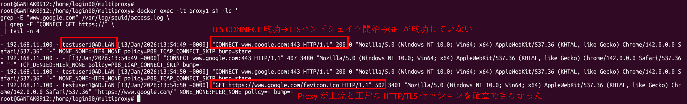
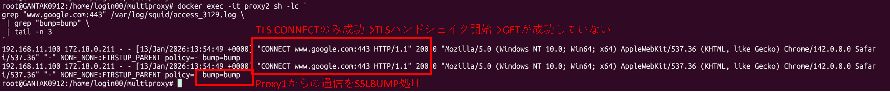
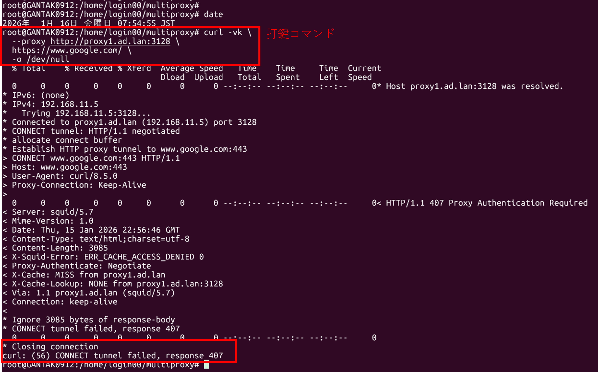
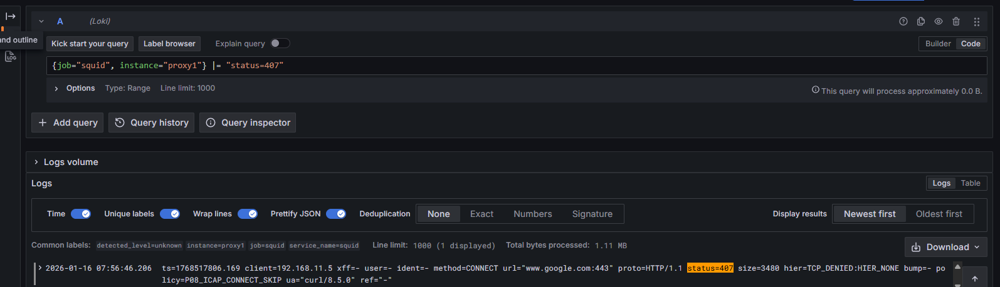
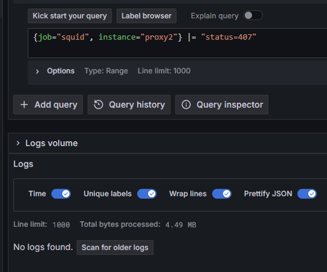
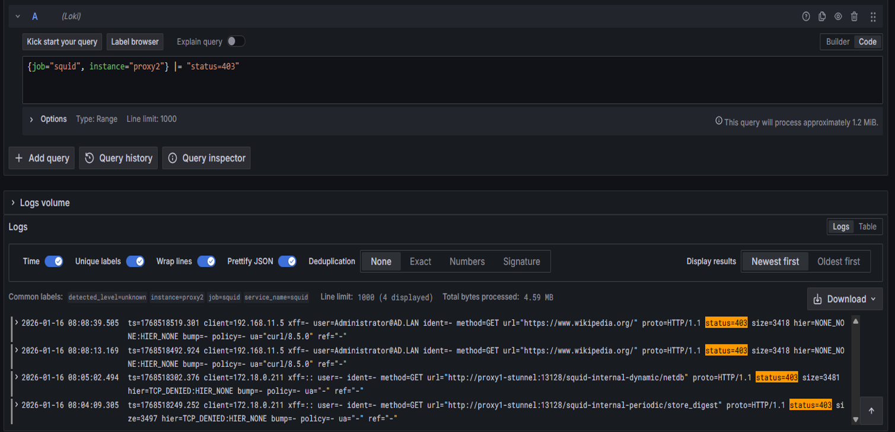
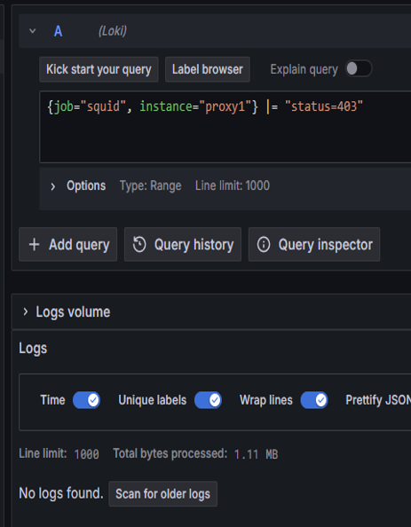
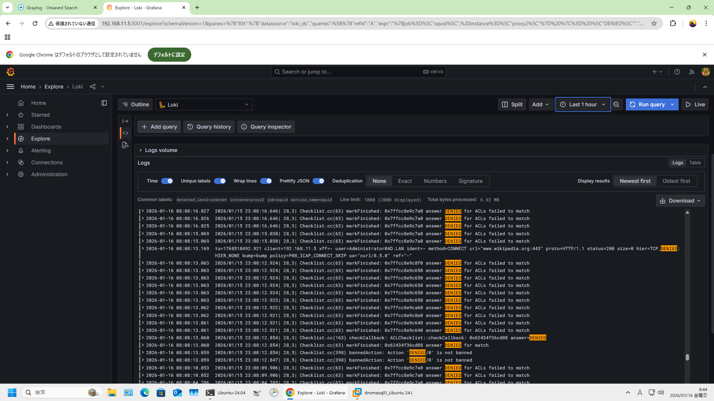
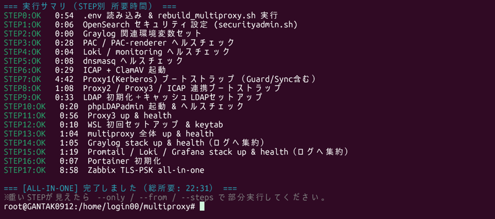

# Verification
（OSS Multi-Layer Proxy & Authentication System）

Version: 2025-01-16
Author: gan2

---

## 0. このページの位置付け

このページは、index.md で示した設計思想・構成が  
**実際に動作していることを、スクリーンショットとログで裏付ける**ための検証ページです。

- 「設計どおりに動いているか」
- 「どこで・何が起きているかを説明できるか」

を **図とログ中心** に確認できる構成にしています。

※ 再現性（構築・起動・検証・復旧の手順）は
<strong><a href="./automation.html">automation</a></strong> に集約しています。
本ページは <strong>動作証跡（スクリーンショット／ログ）</strong>に集中しています。

---

## 目次

- <a href="#highlights">要点</a>
- <a href="#map">index.md の主張 ↔ 検証証跡（対応表）</a>
- <a href="#p1">1. 全体稼働と構成要素一致</a>
- <a href="#p2">2. アーキテクチャと構成対応</a>
- <a href="#p3">3. 経路制御（PAC）</a>
- <a href="#p4">4. 復号（SSLBump）と中継TLS（stunnel）</a>
- <a href="#p5">5. ログ基盤（Loki）での切り分け</a>
- <a href="#p6">6. 自動化と再現性</a>

---

## 要点（3分で把握）

1. **全コンポーネントが稼働し、構成図と 1:1 で対応付け可能**
2. **復号（SSLBump）と中継TLS（stunnel）を分離し、責務境界を明確化**
3. **経路制御（PAC）により、通信経路をログで判別可能**
4. **ログ基盤（Loki）により、通信事象を原因まで追跡可能**
5. **起動・確認・復旧を自動化し、環境差なく再現可能**

読み方のおすすめは「①対応表 → ②PAC（経路の裏取り） → ③SSLBump/stunnel（設計判断） → ④Loki（切り分け能力） → ⑤自動化（再現性）」です。

---

## index.md の主張 ↔ 検証証跡 対応（要点）

> 下表は「何を証明するための図か」を整理した一覧です。  
> **実際の証拠（図面）は、この表の直下にすべて掲載しています。**

  

    <table>
      <thead>
        <tr>
          <th>観点</th>
          <th>何を確認できるか</th>
          <th>対応する証跡（クリックで原寸表示）</th>
        </tr>
      </thead>
      <tbody>

        <tr>
          <td>全体稼働</td>
          <td>構成要素が欠けなく稼働している（部分稼働ではない）</td>
          <td>
            <a href="./images/P1-proof-all.png" target="_blank" rel="noopener"><code>P1-proof-all.png</code></a>
          </td>
        </tr>

        <tr>
          <td>アーキテクチャ</td>
          <td>設計（責務/経路）と実装（稼働要素）が対応している</td>
          <td>
            <a href="./images/P2-arch-compare.png" target="_blank" rel="noopener"><code>P2-arch-compare.png</code></a>
          </td>
        </tr>

        <tr>
          <td>経路制御（PAC）</td>
          <td>PAC により Proxy1 / Proxy2 / DIRECT が分岐し、ログで裏取りできる</td>
          <td>
            <a href="./images/pac-flow-normal-vs-direct.png" target="_blank" rel="noopener"><code>pac-flow-normal-vs-direct.png</code></a> 
            <a href="./images/pac-client-setting.png" target="_blank" rel="noopener"><code>pac-client-setting.png</code></a> 
            <a href="./images/pac-proof-proxy1.png" target="_blank" rel="noopener"><code>pac-proof-proxy1.png</code></a> 
            <a href="./images/pac-proof-proxy2.png" target="_blank" rel="noopener"><code>pac-proof-proxy2.png</code></a> 
            <a href="./images/pac-proof-direct.png" target="_blank" rel="noopener"><code>pac-proof-direct.png</code></a>
          </td>
        </tr>

        <tr>
          <td>復号 / 暗号化</td>
          <td>SSLBump と stunnel の責務分離（復号点とTLS境界が明確）</td>
          <td>
            <a href="./images/double-bump-error.png" target="_blank" rel="noopener"><code>double-bump-error.png</code></a> 
            <a href="./images/double-sslbump-proxy1-access-google-500.png" target="_blank" rel="noopener"><code>double-sslbump-proxy1-access-google-500.png</code></a> 
            <a href="./images/double-sslbump-proxy2-access3129.png" target="_blank" rel="noopener"><code>double-sslbump-proxy2-access3129.png</code></a> 
          </td>
        </tr>

        <tr>
          <td>可観測性（Loki）</td>
          <td>経路と失敗点を時系列で追い、原因レイヤで説明できる</td>
          <td>
            <a href="./images/p6-loki-caseA-proxy1-407.png" target="_blank" rel="noopener"><code>p6-loki-caseA-proxy1-407.png</code></a> 
            <a href="./images/p6-loki-caseA-proxy2-nohit.png" target="_blank" rel="noopener"><code>p6-loki-caseA-proxy2-nohit.png</code></a> 
            <a href="./images/p6-loki-caseB-proxy2-403.png" target="_blank" rel="noopener"><code>p6-loki-caseB-proxy2-403.png</code></a> 
            <a href="./images/p6-loki-caseB-proxy1-nohit.png" target="_blank" rel="noopener"><code>p6-loki-caseB-proxy1-nohit.png</code></a> 
            <a href="./images/p6-loki-caseB-proxy2-cache-denied.png" target="_blank" rel="noopener"><code>p6-loki-caseB-proxy2-cache-denied.png</code></a>
          </td>
        </tr>

        <tr>
          <td>自動化</td>
          <td>環境クリア→起動→初期化→監視/ログ→ヘルス確認まで再現可能</td>
          <td>
            <a href="./images/all_in_one_overview.png" target="_blank" rel="noopener"><code>all_in_one_overview.png</code></a> 
            <a href="./images/all_in_one_summary.png" target="_blank" rel="noopener"><code>all_in_one_summary.png</code></a> 
            <a href="./images/healthcheck-output.png" target="_blank" rel="noopener"><code>healthcheck-output.png</code></a>
          </td>
        </tr>

      </tbody>
    </table>
  

---

## 1. 全体稼働と構成要素一致の確認

<!-- 画像：見やすさ（余白/枠/影）＋タップで原寸（新規タブ） -->
<figure style="margin: 1.2em auto; text-align:center;">
  
  <figcaption style="margin-top:.6em; font-size:.92em; opacity:.85;">
    クリック/タップで原寸表示（別タブ）。
    <strong>構成要素（コンテナ/サービス）が欠けていない</strong>ことを確認しています。
  </figcaption>
</figure>

**確認できること**
- 全コンテナ（構成要素）が **running/healthy** で稼働している（部分稼働ではない）
- Proxy だけでなく、**認証（AD/LDAP/Kerberos）・DNS・ICAP・ログ・監視**などの横断要素も含めて稼働している
- ここでの証明は「構成図の線が正しい」ではなく、**“運用できる最小条件（inventory/health）” が整っている**という意味での稼働証跡

  
<strong>構成要素（すべて OSS）※クリックで開く</strong>

  

    ※ index.md にも記載していますが、本章では「稼働確認（healthcheck）」の観点として構成要素を併記します。
  

  

    

      <table>
        <thead>
          <tr>
            <th>区分</th>
            <th>役割・位置づけ</th>
            <th>採用技術</th>
          </tr>
        </thead>
        <tbody>
          <tr>
            <td>プロキシ</td>
            <td>入口／分岐／出口の3段構成による通信制御</td>
            <td>Squid（3段、経路別ポート設計）</td>
          </tr>
          <tr>
            <td>中継暗号化</td>
            <td>Proxy 間通信の TLS 化（中継区間の暗号化）</td>
            <td>stunnel（Proxy1→2 / Proxy2→3）</td>
          </tr>
          <tr>
            <td>コンテンツ検査</td>
            <td>ウイルス・コンテンツ検査（横断機能）</td>
            <td>ICAP / ClamAV</td>
          </tr>
          <tr>
            <td>認証</td>
            <td>ユーザ認証・認可（SSO）</td>
            <td>OpenLDAP / Samba AD/DC / Kerberos</td>
          </tr>
          <tr>
            <td>DNS / 経路制御</td>
            <td>PAC 配布・名前解決</td>
            <td>dnsmasq（Split DNS）</td>
          </tr>
          <tr>
            <td>ログ</td>
            <td>アクセス・通信ログの集中管理</td>
            <td>Promtail / Loki / Graylog / OpenSearch</td>
          </tr>
          <tr>
            <td>監視</td>
            <td>稼働・性能の可視化</td>
            <td>Zabbix（TLS-PSK + Sidecar）</td>
          </tr>
          <tr>
            <td>自動化</td>
            <td>起動・検証・復旧の再現性確保</td>
            <td>Bash</td>
          </tr>
          <tr>
            <td>実行環境</td>
            <td>検証用基盤</td>
            <td>Ubuntu 24.04（WSL2 mirrored mode）</td>
          </tr>
        </tbody>
      </table>
    

  

---

## 2. アーキテクチャと構成対応

<!-- 画像：見やすさ（余白/枠/影）＋タップで原寸（新規タブ） -->
<figure style="margin: 1.2em auto; text-align:center;">
  
  <figcaption style="margin-top:.6em; font-size:.92em; opacity:.85;">
    クリック/タップで原寸表示（別タブ）。
    <strong>設計（役割/責務）と、実装（起動している構成要素）が1:1で対応していること</strong>を確認しています。
  </figcaption>
</figure>

**確認できること**
- 入口（Proxy1）/ 分岐（Proxy2）/ 出口（Proxy3）の役割分担が、実装と一致している
- Proxy 間の暗号化（stunnel）、検査（ICAP/ClamAV）、認証（AD/LDAP/Kerberos）、可観測性（Loki/Graylog/OpenSearch）、監視（Zabbix）が **“経路の外側（横断）”** として組み込まれている
- “プロキシ3台を繋いだ” ではなく、**実務で扱うような複合要素（認証・検査・ログ・監視）を含む構成**として成立している

---

## 3. 経路制御（PAC）の検証

本章では、<strong>PAC による「出口選択（経路）」</strong>が
<strong>意図どおりに実通信へ反映されている</strong>ことを、
<strong>概要 → 設定 → 実通信ログ</strong>の順に確認します。

### 3-0. PAC による経路制御の全体整理（概要）

<!-- 画像：見やすさ（余白/枠/影）＋タップで原寸（新規タブ） -->
<figure style="margin: 1.2em auto; text-align:center;">
  
  <figcaption style="margin-top:.6em; font-size:.92em; opacity:.85;">
    クリック/タップで原寸表示（別タブ）。
    PAC により <strong>Proxy1 / Proxy2（DIRECT相当） / DIRECT</strong> のいずれを出口として選択するかを整理した全体概要図です。
  </figcaption>
</figure>

**ここで整理しているポイント**
- クライアントは PAC により「通信の出口（経路）」を選択する
- 通常通信は <strong>Proxy1 → Proxy2 → Proxy3</strong> の多段経路
- 条件により以下へ分岐する  
  - <strong>Proxy2 直行</strong>（Proxy1 skip / DIRECT相当）  
  - <strong>DIRECT</strong>（ルーター直通）
- 以降の検証では、<strong>この分岐が “ログの有無” で裏取りできる</strong>ことを示す

### 3-1. クライアント側：PAC ファイルの有効化

<!-- 画像：見やすさ（余白/枠/影）＋タップで原寸（新規タブ） -->
<figure style="margin: 1.2em auto; text-align:center;">
  
  <figcaption style="margin-top:.6em; font-size:.92em; opacity:.85;">
    クリック/タップで原寸表示（別タブ）。
    クライアントが PAC（wpad.dat）を取得し、<strong>自動構成スクリプトが有効化</strong>されている状態です。
  </figcaption>
</figure>

**確認できること**
- クライアントが PAC ファイルを正しく取得・適用している
- 以降の通信が PAC 判定を経由する前提が成立している

### 3-2. Proxy1 経由の通信（通常経路）

<!-- 画像：見やすさ（余白/枠/影）＋タップで原寸（新規タブ） -->
<figure style="margin: 1.2em auto; text-align:center;">
  
  <figcaption style="margin-top:.6em; font-size:.92em; opacity:.85;">
    クリック/タップで原寸表示（別タブ）。
    Proxy1 → Proxy2 → Proxy3 の通常経路で通信していることを、<strong>Proxy1 のアクセスログ</strong>から確認しています。
  </figcaption>
</figure>

**確認できること**
- PAC 判定により Proxy1 が選択されている
- Proxy1 のアクセスログに通信が記録されている
- 通常経路が正しく機能している

### 3-3. Proxy2 経由の通信（Proxy1 skip / DIRECT 相当）

<!-- 画像：見やすさ（余白/枠/影）＋タップで原寸（新規タブ） -->
<figure style="margin: 1.2em auto; text-align:center;">
  
  <figcaption style="margin-top:.6em; font-size:.92em; opacity:.85;">
    クリック/タップで原寸表示（別タブ）。
    Proxy1 を経由せず Proxy2 から通信していることを、<strong>Proxy1 / Proxy2 のログ差分</strong>で確認しています。
  </figcaption>
</figure>

**確認できること**
- Proxy1 にはログが残らない（＝通っていない）
- Proxy2 のみに通信ログが記録されている（＝直行が成立）
- “経路②（Proxy1 skip）” が実通信として成立している

### 3-4. DIRECT（ルーター直通）通信

<!-- 画像：見やすさ（余白/枠/影）＋タップで原寸（新規タブ） -->
<figure style="margin: 1.2em auto; text-align:center;">
  
  <figcaption style="margin-top:.6em; font-size:.92em; opacity:.85;">
    クリック/タップで原寸表示（別タブ）。
    Proxy1 / Proxy2 のいずれにもログが残らず、<strong>ルーターへ直接通信している</strong>ことを確認しています。
  </figcaption>
</figure>

**確認できること**
- PAC 判定により DIRECT が選択されている
- （本システムの）Proxy1/Proxy2/Proxy3 を経由しない DIRECT 通信が成立している

### 3-5. 検証サマリ（PAC 経路制御）

**本章で証明できたこと**
- PAC により <strong>通信経路を動的に切り替えられる</strong>
- 設計した分岐（Proxy1 / Proxy2 / DIRECT）が <strong>実通信として成立</strong>
- 判定結果を <strong>Proxy 側ログの有無</strong>で客観的に確認できる
- 「設定したつもり」ではなく、<strong>挙動として説明できる状態</strong>になっている

---

## 4. 復号（SSLBump）と中継 TLS（stunnel）

本章では、HTTPS 復号（SSLBump）に関する<strong>制約と失敗例</strong>を明示した上で、  
その制約を踏まえて <strong>復号（SSLBump）と中継暗号化（stunnel）を分離設計</strong>したことを検証します。

### 4-0. 前提整理：SSLBump は「1 通信につき 1 回のみ」

    [ Client ]
        |
        |  HTTPS (TLS)
        v
    +-------------------+
    | Proxy1            |
    |-------------------|
    | SSLBump (復号)    |  ← ★ HTTPS復号はここで1回のみ
    +-------------------+
        |
        |  HTTP (復号済み)
        |  + TLS (stunnel)
        v
    +-------------------+
    | Proxy2            |
    |-------------------|
    | 制御 / 中継のみ   |  ← 復号はしない
    +-------------------+
        |
        |  HTTP (復号済み)
        |  + TLS (stunnel)
        v
    +-------------------+
    | Proxy3            |
    |-------------------|
    | 最終出口          |
    +-------------------+
        |
        v
    [ Internet ]

**設計上の重要な前提**
- SSLBump は同一 TLS セッションに対して <strong>二重適用できない</strong>
- 多段 Proxy 構成では「どこで復号するか」を明確にしないと通信が破綻する
- Proxy 間の暗号化は SSLBump ではなく <strong>stunnel（純粋な TLS）</strong>で担保する必要がある

### 4-1. 失敗例：Proxy1 / Proxy2 の二重 SSLBump によるエラー

<!-- 画像：見やすさ（余白/枠/影）＋タップで原寸（新規タブ） -->
<figure style="margin: 1.2em auto; text-align:center;">
  
  <figcaption style="margin-top:.6em; font-size:.92em; opacity:.85;">
    クリック/タップで原寸表示（別タブ）。二重SSLBumpによりブラウザ側でエラーとなる例です。
  </figcaption>
</figure>

<!-- 画像：見やすさ（余白/枠/影）＋タップで原寸（新規タブ） -->
<figure style="margin: 1.2em auto; text-align:center;">
  
  <figcaption style="margin-top:.6em; font-size:.92em; opacity:.85;">
    クリック/タップで原寸表示（別タブ）。Proxy1（入口）側にエラーが記録され、失敗をログで追跡できることを示します。
  </figcaption>
</figure>

<!-- 画像：見やすさ（余白/枠/影）＋タップで原寸（新規タブ） -->
<figure style="margin: 1.2em auto; text-align:center;">
  
  <figcaption style="margin-top:.6em; font-size:.92em; opacity:.85;">
    クリック/タップで原寸表示（別タブ）。Proxy2 側でも復号を試みることで、同一セッションへの二重復号となり破綻する例です。
  </figcaption>
</figure>

**ここで確認できること**

- Proxy1 / Proxy2 の **両方で SSLBump（HTTPS 復号）を実施すると通信は成立しない**
- ブラウザ側では TLS エラーとして失敗し、  
  Proxy 側ログでは **TLS CONNECT は成功しているが、HTTP セッション（GET）が確立していない** ことが確認できる
- Proxy1 側では、CONNECT 200 の後に GET が 5xx で失敗しており、  
  **復号後の HTTP/TLS セッションが正常に確立できていない** 状態である
- Proxy2 側では、`bump-bump` としてログが記録されており、  
  **既に Proxy1 で復号されたセッションに対して、再度 SSLBump を試みている** ことが分かる
- これは Squid の設定ミスではなく、  
  **SSLBump が「1 通信（1 TLS セッション）につき 1 回しか成立しない」という仕様上の制約**によるもの

> 補足：  
> SSLBump は「TLS セッションを終端し、Proxy が MITM として再署名する」動作であり、  
> 同一セッションに対して複数回の終端（再 MITM）を行うことはできない。  
> そのため、多段 Proxy 構成で無制御に SSLBump を有効化すると、  
> 復号済み通信に対する再復号（bump-bump）が発生し、TLS が破綻する。

### 4-2. 改善後の設計：復号（SSLBump）と中継 TLS（stunnel）の分離

上記の失敗例を踏まえ、本構成では **HTTPS 復号と Proxy 間暗号化の責務を明確に分離**しています。

**最終設計方針**

- HTTPS 復号（SSLBump）は **Proxy1 のみ**で実施する  
  - クライアントとの TLS セッションは Proxy1 で終端
  - 復号後の HTTP 通信を内部で制御・検査する
- Proxy 間通信（Proxy1 → Proxy2 → Proxy3）は  
  **SSLBump ではなく stunnel による純粋な TLS トンネル**で暗号化する
- Proxy2 / Proxy3 では SSLBump を行わず、  
  **復号済み（平文 HTTP）通信を stunnel の TLS トンネル内で中継・制御**する

**この設計で得られる効果**

- SSLBump の制約（**1 TLS セッションにつき 1 回のみ復号可能**）を厳密に遵守できる
- 「どこで復号しているか」「どこからは単なる中継 TLS か」が明確になる
- 多段 Proxy 構成でも HTTPS 通信が安定して成立する
- 障害発生時に、
  - 復号（SSLBump）の問題か
  - Proxy 間 TLS（stunnel）の問題か
  を **レイヤ単位で切り分け可能**
- 運用・トラブルシュート時に  
  「TLS ハンドシェイク」「復号」「HTTP 制御」を混同せずに説明できる

> 本検証では、  
> **失敗例（Proxy1 / Proxy2 の二重 SSLBump） → 設計変更 → 正常動作**  
> の流れをログと画面で確認することで、  
> 単なる設定結果ではなく **設計判断の妥当性**を示しています。

### 4-3. 検証サマリ（SSLBump / stunnel）

**本章で証明できたこと**
- SSLBump は <strong>1 通信 1 回</strong>という制約を持つ
- 二重 SSLBump は実際に通信障害を引き起こす
- 復号（SSLBump）と中継暗号化（stunnel）を分離することで問題を解消できる
- 設計判断が <strong>実ログと失敗事例に基づいている</strong>ことを示せている

---

## 5. ログ基盤（Loki）を用いた切り分け

本章では、Loki（Promtail 収集）で <strong>Proxy1 / Proxy2 / Proxy3 の Squid ログ</strong>を横断検索し、
<strong>「どの経路を通ったか」</strong>と<strong>「どこで止まったか」</strong>を
<strong>意図したエラー（デモ）</strong>で短く示します。 
ポイントは <strong>access.log＝経路（結果）</strong> / <strong>cache.log＝原因の裏取り</strong> です。

## ログ収集〜検索の流れ（Proxy → Loki → Grafana）

    [ Client ]
      Browser / curl
           |
         HTTPS
           v
    +-------------------------------+
    |        Squid Proxy            |
    |                               |
    |  Proxy1 / Proxy2 / Proxy3     |
    |                               |
    |  access.log : 経路・結果      |
    |    - status=407 / 403         |
    |                               |
    |  cache.log  : 原因の裏取り    |
    |    - DENIED / TLS / ACL       |
    +---------------+---------------+
                    |
                 file tail
                    v
    +-------------------------------+
    |          Promtail             |
    |                               |
    |  - ログファイルを監視         |
    |  - Proxy別にラベル付与        |
    |                               |
    |  labels:                      |
    |    job="squid"                |
    |    instance="proxy1|2|3"      |
    |    filename="access|cache"   |
    +---------------+---------------+
                    |
                   push
                    v
    +-------------------------------+
    |            Loki               |
    |                               |
    |  - 時系列ログを保存           |
    |  - ラベルで横断検索           |
    |                               |
    |  判断できること:              |
    |   * どのProxyに出たか         |
    |   * どこで止まったか          |
    +---------------+---------------+
                    |
                LogQL query
                    v
    +-------------------------------+
    |      Grafana Explore          |
    |                               |
    |  例:                          |
    |   status=407 -> Proxy1停止    |
    |   status=403 -> Proxy2直行    |
    |                               |
    |  結果 -> 原因 の順で解析      |
    +-------------------------------+

### この章で示すこと（面接官向け：要点）
- <strong>入口（Proxy1）で止まった</strong>のか、<strong>出口側（Proxy2 直行）で止まった</strong>のかをログで判定できる
- 「HTTPコード（結果）」で停止点を確定し、必要に応じて <strong>cache.log（原因の裏取り）</strong>まで掘れる

### 5-1. 前提：Promtail が集めているログ（最小）

- Squid（Proxy1 / Proxy2 / Proxy3）：<strong>access.log</strong> / <strong>cache.log</strong>
- （任意）ICAP / stunnel は必要時のみ（本章は Squid 中心）

### 5-2. デモ方針（2ケースだけで切り分けを示す）

- <strong>Case A：入口で止める（Proxy1 で 407）</strong>  
  → Proxy2 / Proxy3 に到達していないことを Loki で確認
- <strong>Case B：直行出口で止める（Proxy2:3131 で 403）</strong>  
  → Proxy1 を経由していない（直行）ことを Loki で確認

## 5-3. Case A：入口（Proxy1）で 407（認証要求）

### ① 何をしたか（意図した失敗）
- Proxy1 に認証が必要な状態で HTTPS へアクセス  
  → <strong>407 Proxy Authentication Required</strong>

<!-- ②CaseA：打鍵結果 -->
<figure style="margin: 1.2em auto; text-align:center;">
  
  <figcaption style="margin-top:.6em; font-size:.92em; opacity:.85;">
    クリック/タップで原寸表示（別タブ）。
    Proxy1 経由のアクセスで <strong>407（認証要求）</strong> が返ることを確認（意図した失敗）。
  </figcaption>
</figure>

### ② Loki で何を見るか（結論が出る最短ルート）
- Proxy1：<strong>status=407 が出る</strong>
- Proxy2 / Proxy3：<strong>同一宛先が出ない</strong>（＝鎖に到達していない）

### ③ LogQL（コピペ用：同条件で “出る/出ない” を比較）
    {job="squid", instance="proxy1"} |= "status=407"

    {job="squid", instance="proxy2"} |= "status=407"

    {job="squid", instance="proxy3"} |= "status=407"

### ④ ここから言えること（面接官向け一文）
<strong>入口（Proxy1）で止まっている</strong>ため、まずは <strong>認証／入口制御</strong>の問題として切り分けできる  
（Proxy2 以降の TLS / ICAP / 上流ではないと説明できる）

### ⑤ 画像エビデンス（見る順）

<!-- ③CaseA：Loki画面① -->
<figure style="margin: 1.2em auto; text-align:center;">
  
  <figcaption style="margin-top:.6em; font-size:.92em; opacity:.85;">
    クリック/タップで原寸表示（別タブ）。
    Loki で <strong>Proxy1 の access.log 相当</strong>に status=407 が出ていることを確認（入口停止）。
  </figcaption>
</figure>

<!-- ④CaseA：Loki画面② -->
<figure style="margin: 1.2em auto; text-align:center;">
  
  <figcaption style="margin-top:.6em; font-size:.92em; opacity:.85;">
    クリック/タップで原寸表示（別タブ）。
    同一条件で Proxy2 を見ると <strong>ヒットしない（NO HIT）</strong>ことを確認（鎖に到達していない裏取り）。
  </figcaption>
</figure>

## 5-4. Case B：直行出口（Proxy2:3131）で 403（ACL 拒否）

### ① 何をしたか（意図した失敗）
- Proxy2:3131（クライアント直行の出口）に一時的な ACL deny ルールを投入  
  → <strong>403 Forbidden</strong>

<!-- ⑤CaseB：打鍵結果 -->
<figure style="margin: 1.2em auto; text-align:center;">
  
  <figcaption style="margin-top:.6em; font-size:.92em; opacity:.85;">
    クリック/タップで原寸表示（別タブ）。
    Proxy2:3131 直行で <strong>403（ACL 拒否）</strong>が返ることを確認（意図した失敗）。
  </figcaption>
</figure>

### ② Loki で何を見るか（結論が出る最短ルート）
- Proxy2：<strong>status=403 が出る</strong>
- Proxy1：<strong>同一宛先が出ない</strong>（＝Proxy1 を経由していない）

### ③ LogQL（コピペ用：停止点→原因の裏取り）
    {job="squid", instance="proxy2"} |= "status=403"

    {job="squid", instance="proxy1"} |= "status=403"

    {job="squid", instance="proxy2"} |= "DENIED"

### ④ ここから言えること（面接官向け一文）
<strong>直行経路（Proxy2:3131）で止まっている</strong>ため、<strong>PAC による直行経路</strong>と <strong>出口側 ACL</strong>の問題として切り分けできる  
（Proxy1 を通らない＝入口側ではない）

### ⑤ 画像エビデンス（見る順）

<!-- ⑥CaseB：Loki画面① -->
<figure style="margin: 1.2em auto; text-align:center;">
  
  <figcaption style="margin-top:.6em; font-size:.92em; opacity:.85;">
    クリック/タップで原寸表示（別タブ）。
    Loki で Proxy2（直行出口）に <strong>status=403</strong> が出ていることを確認（出口側停止）。
  </figcaption>
</figure>

<!-- ⑦CaseB：Loki画面② -->
<figure style="margin: 1.2em auto; text-align:center;">
  
  <figcaption style="margin-top:.6em; font-size:.92em; opacity:.85;">
    クリック/タップで原寸表示（別タブ）。
    同一条件で Proxy1 を見ると <strong>ヒットしない（NO HIT）</strong>ことを確認（入口を経由していない裏取り）。
  </figcaption>
</figure>

<!-- ⑧CaseB：Loki画面③ -->
<figure style="margin: 1.2em auto; text-align:center;">
  
  <figcaption style="margin-top:.6em; font-size:.92em; opacity:.85;">
    クリック/タップで原寸表示（別タブ）。
    cache.log 側（原因）で <strong>DENIED</strong> を拾い、ACL 拒否であることを裏取り（結果→原因）。
  </figcaption>
</figure>

### 5-5. Loki で迷わない操作（最小）

- Explore を開き、データソースで <strong>Loki</strong> を選択
- 時間範囲を <strong>テスト時刻の前後 2〜5 分</strong>に絞る
- まずは <strong>status=407 / 403</strong> で停止点を確定
- 必要に応じて <strong>DENIED / ERROR</strong> で原因を裏取り（cache.log 相当）

### 5-6. 検証サマリ（Loki 切り分け）

**本章で証明できたこと**

- Loki により Proxy1 / Proxy2 / Proxy3 のログを横断検索できる
- <strong>入口停止（407）</strong>と<strong>直行出口停止（403）</strong>を、意図したエラーで明確に区別できる
- HTTPコード（結果）→ cache.log（原因）という <strong>実運用と同じ切り分け思考</strong>を示せている

---

## 6. 自動化と再現性（Verification）

本章では「自動化がある」だけでなく、<strong>“完走して同一状態へ到達できた” ことを示す証跡</strong>を提示します。  
スクリプトの一覧・役割・運用の考え方は <strong><a href="./automation.html">automation</a></strong> に整理しています。

<!-- 画像：見やすさ（余白/枠/影）＋タップで原寸（新規タブ） -->
<figure style="margin: 1.2em auto; text-align:center;">
  
  <figcaption style="margin-top:.6em; font-size:.92em; opacity:.85;">
    クリック/タップで原寸表示（別タブ）。<strong>環境クリア→起動→初期化→監視/ログ→ヘルス確認</strong>までを一括実行した概要です。
  </figcaption>
</figure>

<!-- 画像：見やすさ（余白/枠/影）＋タップで原寸（新規タブ） -->
<figure style="margin: 1.2em auto; text-align:center;">
  
  <figcaption style="margin-top:.6em; font-size:.92em; opacity:.85;">
    クリック/タップで原寸表示（別タブ）。完了サマリ（所要時間）を示し、<strong>再現性（到達できること）</strong>を客観的に示します。
  </figcaption>
</figure>

<!-- 画像：見やすさ（余白/枠/影）＋タップで原寸（新規タブ） -->
<figure style="margin: 1.2em auto; text-align:center;">
  
  <figcaption style="margin-top:.6em; font-size:.92em; opacity:.85;">
    クリック/タップで原寸表示（別タブ）。全体ヘルスチェックにより、<strong>通信検証の前提（依存関係）が整っている</strong>ことを示します。
  </figcaption>
</figure>

**確認できること**
- **環境クリア → 起動 → 初期化 → 認証 → ログ/監視 → ヘルス確認**までを **STEP0〜17** で一括実行できる
- 手動介入なしで **同一状態（稼働＋検証完了）へ到達**できる
- 失敗しやすい箇所は **Guard / Retry / Warn 継続**で吸収し、最後に **総所要時間**を必ず出力する
- “一度動いたら終わり” ではなく、**破棄→再構築→再検証ができる**ため、改善ループ（設計→検証→修正）に集中できる

### 6-1. コマンド（初学者向け：これだけ）

    cd /home/login00/multiproxy

    # 1) 全再構築（STEP0〜17：クリア→起動→初期化→監視/ログ→ヘルス確認）
    ./all_in_one_rebuild_and_health.sh
    
    # 2) ヘルスチェックだけ（運用時の確認）
    ./scripts/multiproxy_health_all.sh

---

## 補足（読む人向け）

- 本ページは **「動いていることを一目で納得できる」** ことを重視しています  
- 再現性・運用手順・スクリプトの全体整理は **automation** に集約しています  
- 詳細な試験観点（Runbook）を載せる場合は `verification_detail.html` に委譲する想定です
